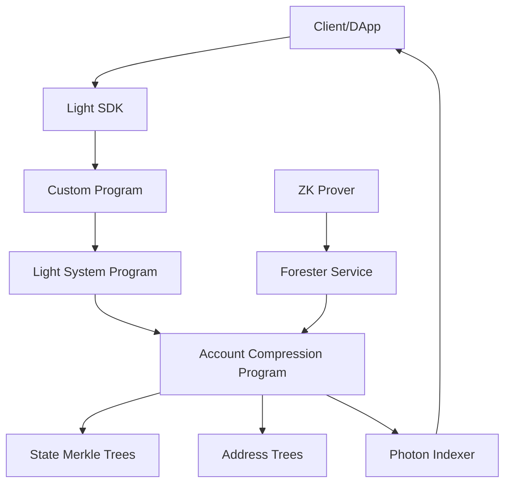
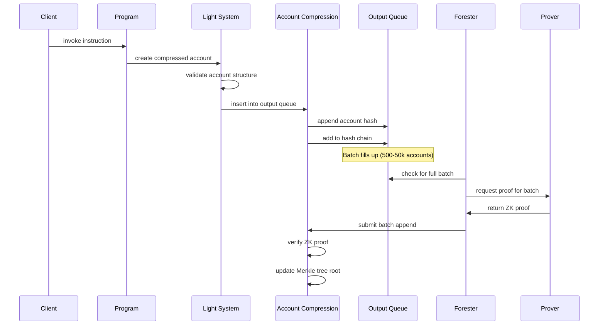
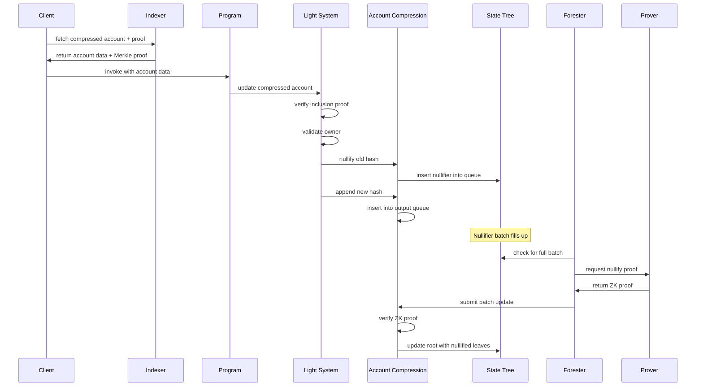

## Architecture Overview

Light Protocol is a modular system consisting of on-chain programs, off-chain infrastructure, and client libraries that work together to enable ZK Compression on Solana.



## Core Components

### On-Chain Programs

#### Account Compression Program

The Account Compression Program is the core of Light Protocol. It owns and manages all Merkle tree accounts.

**Responsibilities:**
- Maintain state and address Merkle trees
- Verify zero-knowledge proofs
- Update tree roots after batch insertions
- Manage nullifier and output queues
- Handle rollover to new trees when capacity is reached

**Program ID:** `CbjvJc1SNx1aav8tU49dJGHu8EUdzQJSMtkjDmV8miqK`

#### Light System Program

The Light System Program enforces the compressed account schema and validates state transitions.

**Responsibilities:**
- Validate compressed account structure
- Perform ownership checks (only owner can modify data)
- Verify ZK proofs for state transitions
- Insert nullifiers for spent accounts
- Append new account hashes to output queues
- Enforce account layout similar to Solana's regular accounts

**Account Schema Enforcement:**
```rust
pub struct CompressedAccount {
    pub owner: Pubkey,              // Only owner can modify
    pub lamports: u64,               // Account balance
    pub address: Option<[u8; 32]>,  // Optional unique identifier
    pub data: Option<CompressedAccountData>,
}
```

**Program ID:** `H5sFv8VwWmjxHYS2GB4fTDsK7uTtnRT4WiixtHrET3bN`

#### Compressed Token Program

An implementation of SPL Token built on ZK Compression, providing fungible and non-fungible compressed tokens.

**Features:**
- SPL Token-compatible interface
- Mint, transfer, burn compressed tokens
- Compress/decompress between SPL and compressed tokens
- Token-2022 extension support (partial)

**Program ID:** `HXVfQ44ATEi9WBKLSCCwM54KokdkzqXci9xCQ7ST9SYN`

#### Registry Program

Manages protocol configuration and forester access control.

**Responsibilities:**
- Register and manage foresters
- Set network fees and parameters
- Control protocol upgrades

### Off-Chain Infrastructure

#### Photon Indexer

The indexer is critical infrastructure that makes compressed state available to clients.

**Functionality:**
- Listens to Solana blocks for Light Protocol events
- Indexes compressed account data from transaction calldata
- Provides RPC API for querying compressed accounts
- Maintains database of current and historical state
- Generates Merkle proofs for inclusion verification

**Data Stored:**
- Compressed account hashes and data
- Merkle tree roots and metadata
- Nullifier queue contents
- Transaction history

**API Endpoints:**
```typescript
// Get compressed account
getCompressedAccount(hash: string)

// Get compressed accounts by owner
getCompressedAccountsByOwner(owner: PublicKey)

// Get multiple compressed accounts
getMultipleCompressedAccounts(hashes: string[])

// Get proof for compressed account
getCompressedAccountProof(hash: string)

// Get validity proof
getValidityProof(hashes: string[])
```

<Info>
The Helius team maintains the canonical Photon indexer implementation and provides hosted RPC endpoints.
</Info>

#### ZK Prover Service

Generates zero-knowledge proofs for batch Merkle tree updates.

**Implementation:**
- Written in Go using Gnark library
- Implements Groth16 SNARK proving system
- Generates circuit-specific proofs

**Proof Types:**
- **Batch Append**: Insert multiple new leaves into state tree
- **Batch Update**: Nullify multiple existing leaves (update in place)
- **Address Append**: Insert addresses into address tree with non-inclusion proof

**Circuit Constraints:**
- Uses Poseidon hash function (ZK-friendly)
- Supports variable batch sizes (100-1000 typical)
- ~1-10 seconds proving time depending on batch size

#### Forester Service

Maintains protocol liveness by processing queues and updating Merkle trees.

**Core Operations:**
1. Monitor nullifier and output queues for full batches
2. Request ZK proof from prover service
3. Submit batch update transaction to update tree roots
4. Zero out bloom filters when safe
5. Roll over to new trees when capacity reached

**Critical for Liveness:**
- Queues have limited capacity
- Full queues prevent new transactions
- Must consistently empty queues to maintain protocol availability
- Permissionless - anyone can run a forester

<Note>
While foresters are critical for liveness, they cannot compromise security. All state transitions are verified on-chain with ZK proofs.
</Note>

## Transaction Flow

### Creating a Compressed Account



### Updating a Compressed Account



## State Storage Design

### Two-Queue System

#### Input Queue (Nullifier Queue)

Stores nullifiers for accounts being spent/updated.

**Structure:**
- Two alternating batches (double-buffering)
- Bloom filters for fast non-inclusion checks
- Hash chains for batch proof generation
- Batch size: typically 500-10,000 nullifiers

**Purpose:**
- Prevent double-spending
- Enable proof-by-index before tree update
- Batch nullifications for efficiency

#### Output Queue

Stores new account hashes waiting to be inserted into the tree.

**Structure:**
- Two alternating batches
- Value arrays store full hashes
- Hash chains for batch proof generation
- Batch size: typically 10,000-50,000 hashes

**Purpose:**
- Buffer new accounts before tree insertion
- Enable immediate reading of newly created accounts
- Batch insertions for efficiency

### Batch Processing

Both queues use a batching system:

1. **Fill Phase**: Accept new insertions into current batch
2. **Full Phase**: Batch is full, switch to alternate batch, ready for tree insertion
3. **Inserted Phase**: ZK proof submitted, tree updated, batch can be cleared
4. **Clear Phase**: Bloom filters zeroed (for nullifier queue), batch ready to fill again

```rust
pub enum BatchState {
    Fill,      // Accepting new insertions
    Full,      // Full, ready for tree update
    Inserted,  // Tree updated, ready to clear
}
```

## Parallelism and Scaling

### Tree Parallelism

Multiple independent Merkle trees enable parallel transaction processing:

- Each tree has its own write lock
- Trees can be updated simultaneously
- Applications can use dedicated trees for better throughput
- Custom programs can derive and own their own trees

### Account Separation

Merkle trees and queues are separate accounts:

- Nullifying from tree A doesn't lock tree B
- Inserting into tree A doesn't lock nullifier queue B
- Enables higher transaction throughput

### Rollover Mechanism

When a Merkle tree reaches capacity:

1. New tree account is created automatically
2. Linked to previous tree via metadata
3. New accounts directed to new tree
4. Old tree remains readable forever
5. Rollover fees amortized across all transactions

<Accordion title="Rollover Fee Calculation">
Rollover fees are distributed across all accounts:

```rust
// For a tree with depth 26 (67M capacity)
let tree_rent = 0.5 SOL;  // One-time cost
let capacity = 2^26;       // 67 million accounts
let fee_per_account = tree_rent / capacity;
// = ~0.0000000075 SOL per account
```

This marginal cost ensures continuous operation without requiring large upfront tree creation costs.
</Accordion>

## Data Availability

Light Protocol ensures data availability through multiple mechanisms:

### Solana Ledger Storage

- All compressed account data is emitted as calldata in transactions
- Stored in Solana's ledger space (not account space)
- Significantly cheaper than account rent
- Available to all validators

### Indexer Redundancy

- Multiple independent indexers can exist
- Open source - anyone can run an indexer
- Syncs from genesis by processing all transactions
- No dependency on specific infrastructure provider

### Cryptographic Guarantees

- On-chain Merkle roots prove state integrity
- Cannot use data not previously emitted through protocol
- ZK proofs verify correct state transitions
- Invalid data is rejected on-chain

## Security Model

### Trust Assumptions

**Trustless Components:**
- On-chain programs (Solana security)
- Merkle root integrity (cryptographic)
- ZK proof verification (mathematical)

**Trust Required:**
- Indexer for data retrieval (but can verify against roots)
- Prover service (but proofs are verified on-chain)
- Forester liveness (but cannot compromise security)

### Attack Vectors and Mitigations

| Attack | Mitigation |
|--------|------------|
| Invalid state transition | ZK proofs verified on-chain |
| Double-spending | Bloom filters + nullifier queue |
| Indexer serves wrong data | Client verifies Merkle proof against on-chain root |
| Malicious prover | Invalid proofs rejected on-chain |
| Forester censorship | Permissionless - anyone can run forester |
| Queue overflow | Protocol limits + forester incentives |

## Program Libraries

Light Protocol provides Rust libraries for building compressed applications:

### Core Libraries

- `light-sdk`: High-level SDK for compressed account operations
- `light-compressed-account`: Account types and hashing
- `light-batched-merkle-tree`: Tree data structures
- `light-hasher`: Poseidon hash implementation
- `light-verifier`: ZK proof verification

### Integration Patterns

```rust
use light_sdk::compressed_account::CompressedAccount;
use light_sdk::merkle_context::MerkleContext;

#[derive(Accounts)]
pub struct CreateCompressed<'info> {
    #[account(mut)]
    pub signer: Signer<'info>,
    
    /// State merkle tree
    pub merkle_tree: AccountLoader<'info, MerkleTree>,
    
    /// Output queue for new accounts
    pub output_queue: AccountLoader<'info, Queue>,
}
```

## Next Steps

<CardGroup cols={2}>
  <Card title="Compressed Accounts" icon="folder-tree" href="/concepts/compressed-accounts">
    Learn about the compressed account model
  </Card>
  <Card title="Merkle Trees" icon="tree" href="/concepts/merkle-trees">
    Understand Merkle tree structures
  </Card>
  <Card title="State Trees" icon="database" href="/concepts/state-trees">
    Explore state tree management
  </Card>
  <Card title="Quick Start" icon="rocket" href="/quickstart">
    Start building with Light Protocol
  </Card>
</CardGroup>
