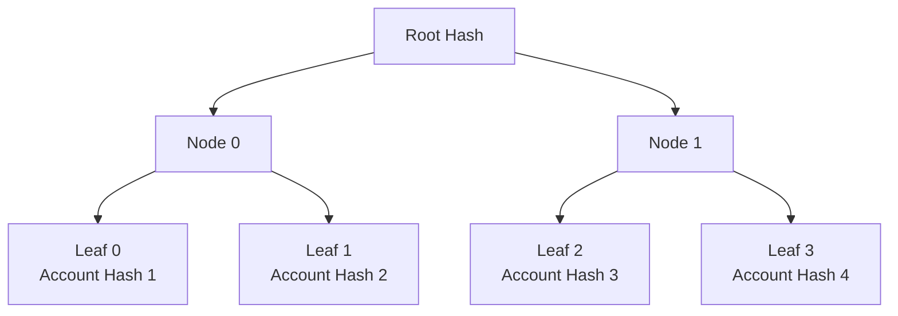
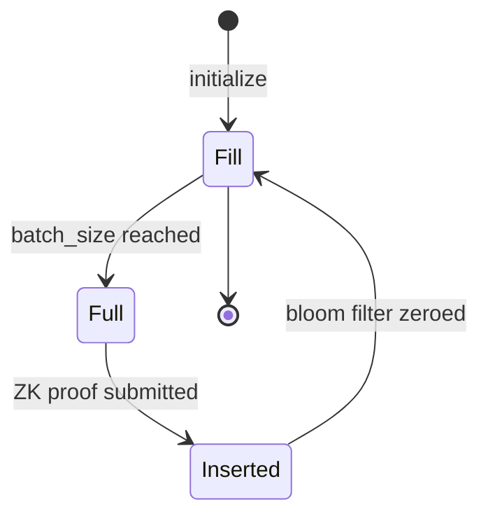

## What are Merkle Trees?

Merkle trees are cryptographic data structures that enable efficient verification of large datasets. Light Protocol uses specialized Merkle trees to store compressed account hashes on-chain while keeping the full data off-chain.



## Tree Properties

### Binary Structure

Each node has exactly two children:
- **Parent hash** = `H(left_child || right_child)`
- **Root hash** = Unique fingerprint of entire tree
- **Leaf hash** = Compressed account hash

### Sparse Trees

Light Protocol uses sparse Merkle trees:
- Most leaves are zero (uninitialized)
- Only non-zero leaves are stored
- Tree can be very large (2^26 capacity = 67M leaves)
- Storage only grows with used leaves

### Poseidon Hash Function

All hashing uses Poseidon:
- ZK-friendly (efficient in circuits)
- Field arithmetic in BN254 curve
- Faster than SHA-256 for ZK proofs
- Resistant to collision attacks

<Info>
Poseidon is specifically designed for zero-knowledge applications, making proof generation 10-100x faster than using SHA-256.
</Info>

## Tree Types in Light Protocol

Light Protocol uses three types of Merkle trees:

### State Merkle Trees

Store compressed account hashes for state data.

**Characteristics:**
- Binary concurrent Merkle trees
- Height: 26 (default) = 67,108,864 capacity
- Each leaf contains a compressed account hash
- Supports nullification (marking leaves as spent)
- Associated with output queue for new accounts

**Use Cases:**
- Compressed token accounts
- Compressed PDA accounts
- Any mutable state

### Address Merkle Trees

Manage unique addresses across a 254-bit address space.

**Characteristics:**
- Indexed Merkle trees (sorted by value)
- Store address ranges as linked lists
- Enable non-inclusion proofs (address doesn't exist)
- Height: 40 (default) = huge capacity
- Start with 1 initialized element (not 0)

**Use Cases:**
- Compressed PDA derivation
- Token mint addresses
- Unique identifier management

### Output State Trees

(Less commonly referenced - generally referred to as output queues paired with state trees)

## Batched Merkle Tree Account

Light Protocol implements batched updates for efficiency:

```rust
pub struct BatchedMerkleTreeMetadata {
    pub tree_type: u64,              // State or Address
    pub sequence_number: u64,        // Increments with each batch update
    pub next_index: u64,             // Next available leaf position
    pub height: u32,                 // Tree depth (26 or 40)
    pub root_history_capacity: u32,  // How many roots to keep
    pub capacity: u64,               // 2^height
    pub queue_batches: QueueBatches, // Associated queue metadata
    pub hashed_pubkey: [u8; 32],    // Truncated tree pubkey
}
```

### Root History

Trees maintain a circular buffer of historical roots:

**Purpose:**
- Allow transactions to reference recent roots
- Enable concurrent transactions
- Provide grace period for proof generation

**Capacity:**
- Typically 100-1000 roots
- Configurable at tree creation
- Older roots overwritten cyclically

```rust
pub struct RootHistory {
    capacity: u32,           // Max roots stored
    current_index: usize,    // Current position in circular buffer
    roots: Vec<[u8; 32]>,   // Historical roots
}
```

<Note>
Transactions must use a root that's still in the history. If a root is too old (overwritten), the transaction will fail.
</Note>

## Tree Operations

### Initialization

```rust
// Initialize state tree
let tree = BatchedMerkleTreeAccount::init(
    account_data,
    &tree_pubkey,
    metadata,
    root_history_capacity: 100,
    input_queue_batch_size: 500,
    input_queue_zkp_batch_size: 100,
    height: 26,
    num_iters: 3,
    bloom_filter_capacity: 160_000,
    TreeType::StateV2,
)?;
```

**Initial State:**
- State trees: All leaves are zero
- Address trees: Contains one initialized element
- Root history: Filled with initial root
- Next index: 0 (state) or 1 (address)

### Appending (New Leaves)

Add new compressed account hashes to the tree:

1. **Client creates account** → Hash inserted into output queue
2. **Queue batch fills** → Forester requests ZK proof
3. **Prover generates proof** → Proves correct hash chain
4. **Forester submits batch** → Updates tree with new root

```rust
// Batch append to state tree
pub fn batch_append(
    ctx: Context<BatchAppend>,
    new_root: [u8; 32],
    proof: CompressedProof,
) -> Result<()> {
    let tree = &mut ctx.accounts.state_tree;
    let queue = &ctx.accounts.output_queue;
    
    // Update tree from output queue
    tree.update_tree_from_output_queue_account(
        queue,
        InstructionDataBatchAppendInputs {
            new_root,
            compressed_proof: proof,
        },
    )?;
}
```

**What the ZK Proof Verifies:**
- Old root is valid (in root history)
- Hash chain correctly computed
- New leaves appended at correct positions
- New root correctly computed

### Nullifying (Update Leaves)

Mark existing leaves as spent:

1. **Client updates account** → Old hash inserted into nullifier queue
2. **Queue batch fills** → Forester requests ZK proof
3. **Prover generates proof** → Proves correct nullification
4. **Forester submits batch** → Overwrites leaves with nullifiers

```rust
// Batch nullify in state tree
pub fn batch_nullify(
    ctx: Context<BatchNullify>,
    new_root: [u8; 32],
    proof: CompressedProof,
) -> Result<()> {
    let tree = &mut ctx.accounts.state_tree;
    
    tree.update_tree_from_input_queue(
        InstructionDataBatchNullifyInputs {
            new_root,
            compressed_proof: proof,
        },
    )?;
}
```

**Nullifier Computation:**
```rust
let nullifier = Poseidon::hashv(&[
    compressed_account_hash.as_slice(),
    leaf_index.to_le_bytes().as_slice(),
    tx_hash.as_slice(),
])?;
```

<Accordion title="Why Include Transaction Hash in Nullifier?">
The transaction hash makes each nullifier unique:

- **Same account** can be nullified multiple times (different txs)
- **Prevents replays** of nullification transactions
- **Bloom filter stores account hash**, not nullifier (for double-spend prevention)
- **Tree stores nullifier** to overwrite the original hash

This allows the protocol to detect double-spending while enabling proper nullification.
</Accordion>

### Reading Roots

```rust
// Get latest root
let root = tree.get_root().unwrap();

// Get root by index
let root = tree.get_root_by_index(root_index)?;

// Get current root index
let index = tree.get_root_index();
```

## Merkle Proofs

To prove a leaf is in the tree, provide its Merkle path:

```rust
pub struct MerkleProof {
    pub path: Vec<[u8; 32]>,  // Sibling hashes from leaf to root
    pub leaf_index: u32,       // Position in tree
    pub root: [u8; 32],        // Root hash to verify against
}
```

**Verification:**
```rust
fn verify_merkle_proof(
    leaf: [u8; 32],
    proof: &MerkleProof,
) -> bool {
    let mut current_hash = leaf;
    
    for (i, sibling) in proof.path.iter().enumerate() {
        let is_left = (proof.leaf_index >> i) & 1 == 0;
        
        current_hash = if is_left {
            Poseidon::hashv(&[current_hash, *sibling])
        } else {
            Poseidon::hashv(&[*sibling, current_hash])
        };
    }
    
    current_hash == proof.root
}
```

**Path Length** = Tree height (e.g., 26 hashes for height-26 tree)

## Queue System

Trees have associated queues for batching:

### Input Queue (Nullifier Queue)

```rust
pub struct InputQueue {
    pub batches: [Batch; 2],              // Two alternating batches
    pub bloom_filter_stores: [&[u8]; 2], // For double-spend prevention
    pub hash_chain_stores: [Vec<[u8; 32]>; 2], // For ZK proof
}
```

**Features:**
- Bloom filters for fast non-inclusion checks
- Hash chains for batch proof generation
- Double buffering (fill one while updating from other)

### Output Queue

```rust
pub struct OutputQueue {
    pub batches: [Batch; 2],              // Two alternating batches  
    pub value_vecs: [Vec<[u8; 32]>; 2],  // Store actual hashes
    pub hash_chain_stores: [Vec<[u8; 32]>; 2], // For ZK proof
}
```

**Features:**
- Stores full account hashes
- Enables proof-by-index before tree update
- Hash chains for batch proof generation

### Batch Lifecycle



```rust
pub enum BatchState {
    Fill,      // Accepting new insertions
    Full,      // Ready for tree update
    Inserted,  // Tree updated, ready to clear
}
```

## Bloom Filters

Used in input queues to prevent double-spending:

**Structure:**
```rust
pub struct BloomFilter {
    pub num_iters: usize,      // Hash iterations (3-5)
    pub capacity: u64,          // Bits available (8x batch size typical)
    pub store: &mut [u8],       // Bit array
}
```

**Operations:**
```rust
// Insert value
bloom_filter.insert(&compressed_account_hash)?;

// Check membership (may have false positives)
if bloom_filter.contains(&compressed_account_hash) {
    return Err("Already spent");
}
```

**Purpose:**
- Prevent double-spending within batch
- Fast O(1) checks
- Probabilistic (false positives possible, no false negatives)
- Must be zeroed when batch is cleared

<Info>
Bloom filters provide an efficient first line of defense against double-spending. The actual nullification in the tree provides definitive proof.
</Info>

## Hash Chains

Used to commit to a batch of values:

**Construction:**
```rust
// Start with first value
let mut hash_chain = values[0];

// Chain subsequent values
for value in values[1..].iter() {
    hash_chain = Poseidon::hashv(&[
        hash_chain.as_slice(),
        value.as_slice(),
    ])?;
}
```

**Purpose:**
- Single hash commits to entire batch
- Used as public input to ZK circuit
- Prover must know all values to compute chain
- Verifier only needs final hash

**ZK Batch Size:**
- Typical: 100-500 values per hash chain
- Multiple hash chains per batch (batch_size / zkp_batch_size)
- Each hash chain gets its own ZK proof

## Tree Capacity and Rollover

### Capacity

```rust
capacity = 2^height

// Examples:
height 26 → 67,108,864 leaves
height 30 → 1,073,741,824 leaves
height 40 → 1,099,511,627,776 leaves (address trees)
```

### Rollover Process

When a tree reaches capacity:

1. **New tree created** with same configuration
2. **Linked via metadata** (next_merkle_tree field)
3. **New accounts** directed to new tree
4. **Old tree remains** readable forever
5. **Rollover fee** amortized across all accounts

```rust
pub struct RolloverMetadata {
    pub rollover_fee: u64,        // Fee per account for next tree
    pub rollover_threshold: u64,  // When to trigger rollover
    pub next_merkle_tree: Pubkey, // Next tree in chain
}
```

**Fee Calculation:**
```rust
let tree_rent = 0.5 SOL;  // One-time cost for new tree
let capacity = 2^26;       // 67M leaves
let fee_per_account = tree_rent / capacity;
// ≈ 0.0000000075 SOL per account
```

## Indexed Merkle Trees (Address Trees)

Special tree type for managing unique addresses:

### Structure

```rust
pub struct IndexedLeaf {
    pub value: [u8; 32],        // Address value
    pub next_index: u32,        // Next leaf in sorted order
    pub next_value: [u8; 32],   // Next address value
}
```

### Properties

- **Sorted by value**: Enables range proofs
- **Linked list**: Each leaf points to next
- **Non-inclusion proofs**: Prove address not in tree
- **Efficient updates**: Only touch neighboring leaves

### Non-Inclusion Proof

To prove an address doesn't exist:

1. Find leaf with value just below target
2. Check that leaf's next_value is above target
3. Verify both leaves are in tree (Merkle proofs)
4. Result: Target address is in the gap

```rust
// Prove address 'A' doesn't exist
// Find leaf with value < A
let low_leaf = find_low_leaf(address);

// Check: low_leaf.value < A < low_leaf.next_value
if low_leaf.value < address && address < low_leaf.next_value {
    // Address doesn't exist (non-inclusion proven)
    // Safe to insert
}
```

## Tree Account Size

Calculating on-chain storage requirements:

```rust
fn get_tree_account_size(
    height: u32,
    root_history_capacity: u32,
    batch_size: u64,
    zkp_batch_size: u64,
    bloom_filter_capacity: u64,
) -> usize {
    let metadata_size = size_of::<BatchedMerkleTreeMetadata>();
    
    let root_history_size = 
        root_history_capacity * 32; // 32 bytes per root
    
    let queue_size = 
        2 * batch_size * 32 +              // Value stores
        2 * (batch_size / zkp_batch_size) * 32 +  // Hash chain stores
        2 * (bloom_filter_capacity / 8);   // Bloom filters
    
    metadata_size + root_history_size + queue_size
}

// Example: Default state tree
// height: 26, roots: 100, batch: 10000, zkp_batch: 500, bloom: 160000
// Size: ≈ 700 KB → ~0.005 SOL rent
```

## Best Practices

### Choosing Tree Height

```rust
// Small application (< 1M accounts)
height: 20 → 1,048,576 capacity

// Medium application (1M - 100M accounts)  
height: 26 → 67,108,864 capacity (default)

// Large application (> 100M accounts)
height: 30 → 1,073,741,824 capacity
```

### Root History Size

```rust
// Fast-moving application (many concurrent txs)
root_history_capacity: 1000

// Normal application
root_history_capacity: 100 (default)

// Low-traffic application  
root_history_capacity: 10
```

### Batch Sizes

```rust
// High-throughput (more accounts per tree update)
batch_size: 50_000
zkp_batch_size: 500

// Balanced (default)
batch_size: 10_000
zkp_batch_size: 500

// Low-latency (faster tree updates)
batch_size: 500
zkp_batch_size: 100
```

## Next Steps

<CardGroup cols={2}>
  <Card title="State Trees" icon="database" href="/concepts/state-trees">
    Learn about state tree management
  </Card>
  <Card title="Compressed Accounts" icon="folder-tree" href="/concepts/compressed-accounts">
    Understand compressed account model
  </Card>
  <Card title="Forester Guide" icon="tree" href="/forester/overview">
    Run a forester to maintain trees
  </Card>
  <Card title="Tree Configuration" icon="gear" href="/concepts/state-trees">
    Configure trees for your application
  </Card>
</CardGroup>
