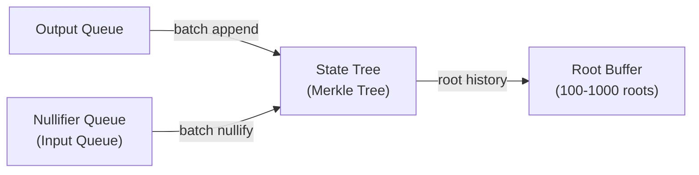
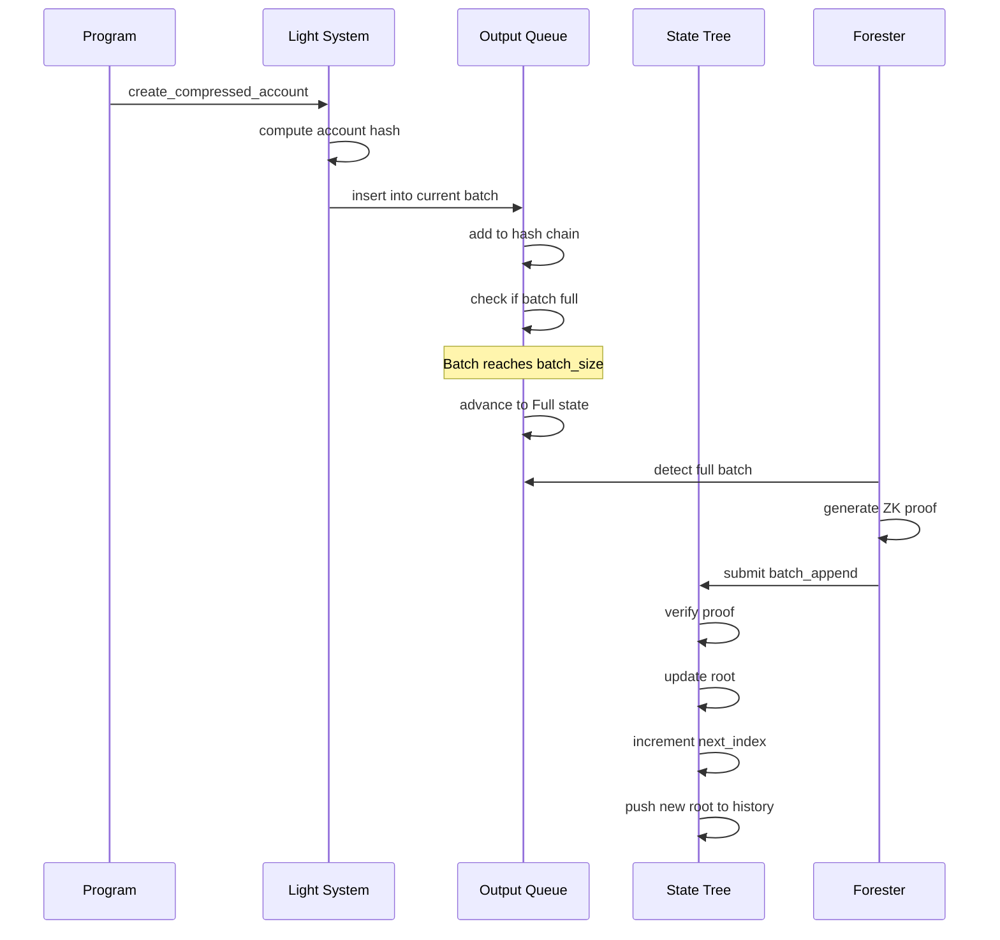
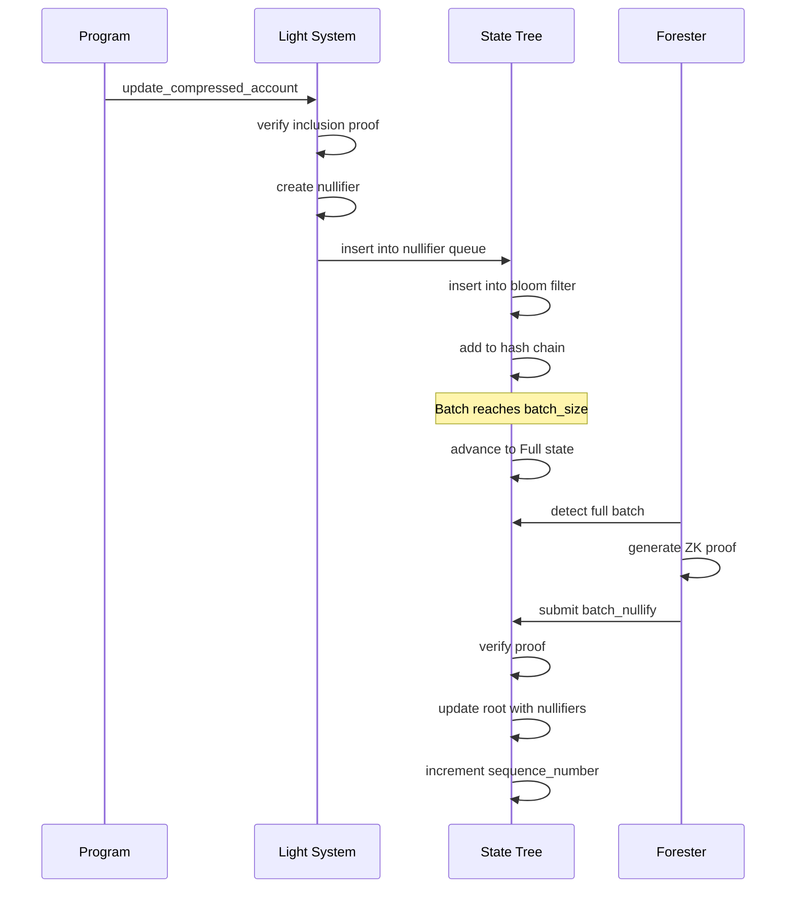

## What are State Trees?

State trees are specialized Merkle trees that store compressed account hashes in Light Protocol. They enable efficient cryptographic verification of state while keeping the full account data off-chain.

<Info>
State trees are the backbone of ZK Compression - they provide the cryptographic guarantee that compressed state is valid while dramatically reducing storage costs.
</Info>

## State Tree Architecture

A state tree consists of multiple components working together:



### Core Components

1. **Merkle Tree Account**: Stores roots and metadata
2. **Nullifier Queue**: Buffers accounts being spent/updated
3. **Output Queue**: Buffers new account hashes
4. **Root History**: Circular buffer of recent roots
5. **Bloom Filters**: Prevent double-spending during batch

## State Tree Metadata

```rust
pub struct BatchedMerkleTreeMetadata {
    // Tree configuration
    pub tree_type: u64,              // Always StateV2 (3)
    pub height: u32,                 // Tree depth (typically 26)
    pub capacity: u64,               // 2^height leaves
    pub hashed_pubkey: [u8; 32],    // Truncated tree pubkey for hashing
    
    // Current state
    pub sequence_number: u64,        // Increments with each update
    pub next_index: u64,             // Next leaf position for append
    pub nullifier_next_index: u64,   // Next nullifier index
    
    // Root history
    pub root_history_capacity: u32,  // Max roots stored
    
    // Queue configuration
    pub queue_batches: QueueBatches,
    
    // Associated accounts
    pub metadata: MerkleTreeMetadata,
}
```

### Metadata Fields Explained

**sequence_number**: 
- Increments with each batch update (append or nullify)
- Used to track when roots can be safely removed
- Critical for bloom filter zeroing logic

**next_index**:
- Position where next new leaf will be inserted
- Increments by batch size on each append
- Used in compressed account hash computation

**nullifier_next_index**:
- Tracks nullification progress for indexers
- Not used in on-chain logic
- Helps indexers maintain consistent state

## Tree Initialization

Creating a new state tree:

```rust
pub fn initialize_state_tree(
    ctx: Context<InitializeStateTree>,
    params: InitStateTreeParams,
) -> Result<()> {
    let tree_data = &mut ctx.accounts.merkle_tree.data.borrow_mut();
    let queue_data = &mut ctx.accounts.output_queue.data.borrow_mut();
    
    // Initialize tree account
    let tree = BatchedMerkleTreeAccount::init(
        tree_data,
        &ctx.accounts.merkle_tree.key(),
        MerkleTreeMetadata {
            associated_queue: ctx.accounts.output_queue.key(),
            access_metadata: AccessMetadata::new(
                ctx.accounts.authority.key(),
                params.program_owner,
                params.forester,
            ),
            rollover_metadata: RolloverMetadata::new(
                params.index,
                rollover_fee,
                params.rollover_threshold,
                params.network_fee,
            ),
        },
        params.root_history_capacity,
        params.input_queue_batch_size,
        params.input_queue_zkp_batch_size,
        params.height,
        params.bloom_filter_num_iters,
        params.bloom_filter_capacity,
        TreeType::StateV2,
    )?;
    
    // Initialize output queue
    BatchedQueueAccount::init(
        queue_data,
        QueueMetadata {
            associated_merkle_tree: ctx.accounts.merkle_tree.key(),
            queue_type: QueueType::OutputStateV2,
        },
        params.output_queue_batch_size,
        params.output_queue_zkp_batch_size,
        params.bloom_filter_num_iters,
        params.bloom_filter_capacity,
        ctx.accounts.output_queue.key(),
        tree.capacity,
    )?;
}
```

### Initialization Parameters

```rust
pub struct InitStateTreeParams {
    // Tree structure
    pub height: u32,                    // Default: 26 (67M capacity)
    pub root_history_capacity: u32,     // Default: 100
    
    // Input queue (nullifier)
    pub input_queue_batch_size: u64,    // Default: 500
    pub input_queue_zkp_batch_size: u64, // Default: 100
    
    // Output queue (append)
    pub output_queue_batch_size: u64,   // Default: 10,000
    pub output_queue_zkp_batch_size: u64, // Default: 500
    
    // Bloom filters
    pub bloom_filter_capacity: u64,     // Default: 160,000 bits
    pub bloom_filter_num_iters: u64,    // Default: 3
    
    // Access control
    pub program_owner: Option<Pubkey>,  // Can derive owned trees
    pub forester: Option<Pubkey>,       // Authorized forester
    
    // Rollover
    pub rollover_threshold: Option<u64>, // When to create next tree
    pub network_fee: u64,               // Protocol fee
    pub index: u64,                     // Tree index in chain
}
```

<Accordion title="Choosing Good Parameters">
**Tree Height:**
- 26 (default): 67M capacity, ~0.005 SOL rent
- 30: 1B capacity, ~0.02 SOL rent
- Larger = more capacity but higher rent

**Root History:**
- 100 (default): ~10 seconds of validity at 10 updates/sec
- 1000: ~100 seconds validity
- Larger = longer validity window but more storage

**Batch Sizes:**
- Input (nullifier): Smaller (500-2000) for faster nullification
- Output (append): Larger (10k-50k) for better throughput
- ZKP batch: Balance between proof time and tree update frequency

**Bloom Filters:**
- Capacity: 10-20x batch size to minimize false positives
- Iterations: 3-5 for good false positive rate (~0.1%)
</Accordion>

## State Transitions

### Appending New Accounts

When programs create compressed accounts:



**Insertion Flow:**

1. **Insert into Output Queue**
   ```rust
   pub fn insert_into_output_queue(
       &mut self,
       account_hash: &[u8; 32],
       current_slot: u64,
   ) -> Result<()> {
       self.output_queue.insert_into_current_batch(
           account_hash,
           &current_slot,
       )
   }
   ```

2. **Batch Fills Up**
   - Current batch reaches `batch_size`
   - State transitions: Fill → Full
   - Switches to alternate batch for new insertions
   - Full batch ready for tree update

3. **Forester Submits Proof**
   ```rust
   pub fn batch_append(
       ctx: Context<BatchAppend>,
       new_root: [u8; 32],
       proof: CompressedProof,
   ) -> Result<()> {
       let tree = &mut ctx.accounts.state_tree;
       let queue = &ctx.accounts.output_queue;
       
       tree.update_tree_from_output_queue_account(
           queue,
           InstructionDataBatchAppendInputs {
               new_root,
               compressed_proof: proof,
           },
       )
   }
   ```

4. **Tree Update**
   - Verify ZK proof
   - Increment sequence number
   - Update next_index (old + batch_size)
   - Push new root to root history
   - Mark batch as Inserted

### Nullifying Existing Accounts

When programs update or close compressed accounts:



**Nullification Flow:**

1. **Create Nullifier**
   ```rust
   let nullifier = Poseidon::hashv(&[
       compressed_account_hash.as_slice(),
       leaf_index.to_le_bytes().as_slice(),
       tx_hash.as_slice(),
   ])?;
   ```

2. **Insert into Nullifier Queue**
   ```rust
   pub fn insert_nullifier(
       &mut self,
       compressed_account_hash: &[u8; 32],
       leaf_index: u64,
       tx_hash: &[u8; 32],
       current_slot: u64,
   ) -> Result<()> {
       // Compute nullifier
       let nullifier = create_nullifier(
           compressed_account_hash,
           leaf_index,
           tx_hash,
       )?;
       
       // Insert into current batch
       // - Add to hash chain (nullifier)
       // - Add to bloom filter (account hash)
       // - Check non-inclusion in other batch
       insert_into_current_queue_batch(
           QueueType::InputStateV2,
           &mut self.queue_batches,
           &mut self.bloom_filter_stores,
           &mut self.hash_chain_stores,
           &nullifier,
           Some(compressed_account_hash),
           None,
           &current_slot,
       )
   }
   ```

3. **Bloom Filter Check**
   - Insert `compressed_account_hash` into current bloom filter
   - Check non-inclusion in other bloom filter
   - Prevents double-spending within queue

4. **Forester Nullifies Batch**
   ```rust
   pub fn batch_nullify(
       ctx: Context<BatchNullify>,
       new_root: [u8; 32],
       proof: CompressedProof,
   ) -> Result<()> {
       ctx.accounts.state_tree.update_tree_from_input_queue(
           InstructionDataBatchNullifyInputs {
               new_root,
               compressed_proof: proof,
           },
       )
   }
   ```

5. **Tree Update**
   - Verify ZK proof
   - Overwrite leaves with nullifiers
   - Increment sequence number
   - Push new root to root history
   - Mark batch as Inserted

<Note>
Nullification doesn't change next_index - we're updating existing leaves, not appending new ones.
</Note>

## Root History Management

The root history is a circular buffer:

```rust
pub struct RootHistory {
    capacity: u32,              // Max roots (e.g., 100)
    roots: Vec<[u8; 32]>,      // Circular buffer
    current_index: usize,       // Current position
}

impl RootHistory {
    pub fn push(&mut self, root: [u8; 32]) {
        self.roots[self.current_index] = root;
        self.current_index = (self.current_index + 1) % self.capacity;
    }
    
    pub fn last(&self) -> &[u8; 32] {
        let prev_index = (self.current_index + self.capacity - 1) % self.capacity;
        &self.roots[prev_index]
    }
}
```

### Root Validity Window

Transactions must reference a root that's still in history:

```rust
// Check if root is in history
fn verify_root(
    tree: &StateTree,
    root_index: u16,
) -> Result<()> {
    let root = tree.get_root_by_index(root_index)?;
    
    if root == [0u8; 32] {
        return Err("Root has been zeroed out");
    }
    
    Ok(())
}
```

**Root Lifecycle:**
1. Created by tree update
2. Pushed to root history
3. Valid for ~capacity updates
4. Eventually overwritten by newer roots
5. May be zeroed early (see Bloom Filter Zeroing)

## Bloom Filter Zeroing

Bloom filters must be cleared before batch reuse:

### When to Zero

Filters are zeroed when:
1. Previous batch is fully inserted
2. Current batch is 50% full
3. All roots containing previous batch values are invalid

### Root Zeroing Logic

```rust
fn zero_out_previous_batch_bloom_filter(
    &mut self
) -> Result<()> {
    let current_batch_index = self.queue_batches.pending_batch_index;
    let previous_batch_index = 1 - current_batch_index;
    
    let previous_batch = &self.queue_batches.batches[previous_batch_index];
    let current_batch = &self.queue_batches.batches[current_batch_index];
    
    // Check conditions
    let previous_inserted = previous_batch.state == BatchState::Inserted;
    let current_half_full = 
        current_batch.num_inserted >= self.queue_batches.batch_size / 2;
    let not_already_zeroed = !previous_batch.bloom_filter_is_zeroed();
    
    if previous_inserted && current_half_full && not_already_zeroed {
        // Zero out bloom filter
        self.bloom_filter_stores[previous_batch_index]
            .iter_mut()
            .for_each(|x| *x = 0);
        
        // Zero out overlapping roots
        let sequence_number = previous_batch.sequence_number;
        let root_index = previous_batch.root_index;
        self.zero_out_roots(sequence_number, root_index);
        
        // Mark as zeroed
        previous_batch.set_bloom_filter_to_zeroed();
    }
    
    Ok(())
}
```

### Root Zeroing Example

```rust
fn zero_out_roots(
    &mut self,
    batch_sequence_number: u64,
    batch_root_index: u32,
) {
    // Check if overlapping roots exist
    if batch_sequence_number > self.sequence_number {
        let num_overlapping = batch_sequence_number - self.sequence_number;
        let mut oldest_root_index = self.root_history.first_index();
        
        // Zero out overlapping roots (except the last safe one)
        for _ in 1..num_overlapping {
            self.root_history[oldest_root_index] = [0u8; 32];
            oldest_root_index = (oldest_root_index + 1) % self.root_history.capacity;
        }
    }
}
```

<Accordion title="Why Zero Roots?">
**Security Requirement:**

Once a bloom filter is zeroed, we must ensure no valid roots exist that could prove inclusion of values from that batch.

**Example Timeline:**
- Batch 0 inserted over 4 tree updates → roots R0, R1, R2, R3
- Batch 0 finished at sequence_number=13, root_index=3
- Current sequence_number=8
- Difference: 13-8=5 overlapping roots

**Solution:**
Zero out roots R0, R1, R2 (keep R3 as the safe root). This prevents proving inclusion of batch 0 values using old roots after the bloom filter is cleared.
</Accordion>

## Proof Methods

### Proof by Index

Fast proof for accounts in output queue:

```rust
pub fn prove_by_index(
    queue: &OutputQueue,
    leaf_index: u64,
    account_hash: &[u8; 32],
) -> Result<()> {
    queue.prove_inclusion_by_index(leaf_index, account_hash)
}
```

**Characteristics:**
- O(1) lookup in value array
- Only works while in queue (before tree insertion)
- Fails if account already nullified
- No ZK proof required

### Proof by Merkle

Cryptographic proof for accounts in tree:

```rust
pub fn prove_by_merkle(
    tree: &StateTree,
    account_hash: &[u8; 32],
    merkle_proof: &MerkleProof,
    root_index: u16,
) -> Result<()> {
    let root = tree.get_root_by_index(root_index)?;
    verify_merkle_proof(account_hash, merkle_proof, root)
}
```

**Characteristics:**
- Works for any historical state (within root history)
- Requires Merkle proof from leaf to root
- Requires ZK proof for state transitions
- Higher CU cost than proof by index

## Queue Overflow Prevention

Queues have limited capacity:

```rust
pub fn check_tree_is_full(&self) -> Result<()> {
    if self.next_index + self.queue_batches.batch_size >= self.capacity {
        return Err(BatchedMerkleTreeError::TreeIsFull);
    }
    Ok(())
}

pub fn check_queue_overflow(&self) -> Result<()> {
    if self.queue_batches.next_index >= self.capacity {
        return Err(BatchedMerkleTreeError::TreeIsFull);
    }
    Ok(())
}
```

### Overflow Scenarios

**Output Queue:**
- Fills faster than foresters can process
- Both batches full, can't accept new accounts
- Prevents any new compressed account creation

**Nullifier Queue:**
- Fills faster than foresters can nullify
- Both batches full, can't accept nullifications
- Prevents any compressed account updates/closes

### Mitigation

1. **Forester Incentives**: Economic rewards for consistent processing
2. **Multiple Foresters**: Redundancy prevents single point of failure  
3. **Monitoring**: Alert when queue usage > 80%
4. **Rollover**: Automatic tree rollover before capacity reached

## Tree Rollover

When tree reaches capacity:

```rust
pub fn rollover_state_tree(
    ctx: Context<RolloverStateTree>,
) -> Result<()> {
    let old_tree = &ctx.accounts.old_tree;
    let new_tree = &mut ctx.accounts.new_tree;
    
    // Verify rollover conditions
    require!(
        old_tree.next_index + old_tree.queue_batches.batch_size >= old_tree.capacity,
        "Tree not ready for rollover"
    );
    
    // Link trees
    old_tree.metadata.next_merkle_tree = new_tree.key();
    
    // Initialize new tree with same params
    initialize_state_tree(ctx, old_tree.get_init_params())?;
    
    Ok(())
}
```

### Rollover Process

1. **Trigger Condition**: `next_index + batch_size >= capacity`
2. **Create New Tree**: Same configuration as old tree
3. **Link Trees**: `old_tree.next_merkle_tree = new_tree_pubkey`
4. **Redirect Traffic**: New accounts go to new tree
5. **Old Tree**: Remains readable forever

### Rollover Fees

```rust
pub struct RolloverMetadata {
    pub rollover_fee: u64,           // Fee per account
    pub rollover_threshold: Option<u64>, // When to trigger
    pub network_fee: u64,            // Protocol fee
}

// Fee charged on each account creation
let fee = tree.metadata.rollover_metadata.rollover_fee;
```

**Fee Calculation:**
```
rollover_fee = next_tree_rent / current_tree_capacity
```

## Performance Characteristics

### Throughput

| Operation | Cost | Throughput |
|-----------|------|------------|
| Insert to queue | 5k-10k CU | 10k-50k TPS |
| Batch append | 200k-400k CU | 100-500 accounts/update |
| Batch nullify | 200k-400k CU | 100-500 accounts/update |
| Proof by index | 5k CU | 100k TPS |
| Proof by Merkle | 100k-200k CU | 1k TPS |

### Latency

**Time to Readable:**
- Insert to queue: Immediate (same transaction)
- Proof by index: Immediate (queue lookup)
- Proof by Merkle: ~10-60 seconds (forester processing + 1 slot finality)

**Update Frequency:**
- Depends on batch size and transaction volume
- Typical: 1-10 updates per minute per tree
- High traffic: Up to 100 updates per minute

## Next Steps

<CardGroup cols={2}>
  <Card title="Build a Program" icon="code" href="/guides/custom-programs">
    Create compressed accounts in your program
  </Card>
  <Card title="Forester Guide" icon="tree" href="/forester/overview">
    Run a forester to maintain state trees
  </Card>
  <Card title="Compressed Accounts" icon="folder-tree" href="/concepts/compressed-accounts">
    Deep dive into account structure
  </Card>
  <Card title="Merkle Trees" icon="diagram-project" href="/concepts/merkle-trees">
    Learn about Merkle tree fundamentals
  </Card>
</CardGroup>
