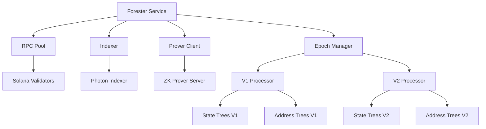
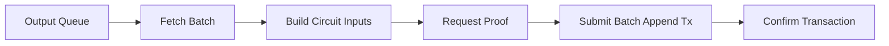
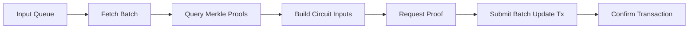
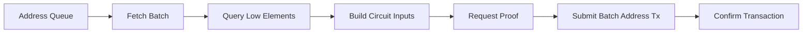

The Forester is a critical off-chain service that maintains Light Protocol's Merkle trees by processing pending queue items and submitting zero-knowledge proofs to Solana. It acts as the operator that keeps compressed state synchronized and up-to-date.

## What is the Forester?

The Forester processes two types of queues:

<CardGroup cols={2}>
  <Card title="State Tree Queues" icon="circle-nodes">
    Processes input (nullify) and output (append) queues for state Merkle trees that store compressed account data
  </Card>
  <Card title="Address Tree Queues" icon="hash">
    Processes address queues for indexed Merkle trees that ensure address uniqueness
  </Card>
</CardGroup>

## Architecture



### Core Components

**RPC Pool**
Manages connections to Solana validators with retry logic, rate limiting, and health checks.

**Indexer Client**  
Queries the Photon indexer for queue status, Merkle proofs, and tree metadata.

**Prover Client**
Submits proof requests to the ZK prover server and polls for results.

**Epoch Manager**
Coordinates tree discovery, queue processing, and work reporting across epoch boundaries.

**V1 Processor**
Handles legacy trees using single-item transactions.

**V2 Processor**
Handles batched trees using zero-knowledge proofs for batch operations.

## How It Works

The Forester operates in a continuous loop:

<Steps>
  <Step title="Tree Discovery">
    Discovers all state and address trees from the registry program
  </Step>
  <Step title="Queue Polling">
    Checks each tree's queue for pending items (via indexer or on-chain)
  </Step>
  <Step title="Batch Assembly">
    Groups pending items into batches based on tree type and version
  </Step>
  <Step title="Proof Generation">
    Requests ZK proofs from the prover server for V2 batches
  </Step>
  <Step title="Transaction Submission">
    Submits transactions with proofs to update tree state on-chain
  </Step>
  <Step title="Confirmation">
    Polls transaction status and retries on failure
  </Step>
  <Step title="Work Reporting">
    Reports completed work to the registry for rewards
  </Step>
</Steps>

## Tree Versions

Light Protocol supports two tree versions:

### V1 Trees (Legacy)

- **Processing**: One item per transaction
- **Proofs**: No zero-knowledge proofs required
- **Throughput**: Limited by transaction rate (~50 items/sec)
- **Use Case**: Legacy support, gradual migration to V2

### V2 Trees (Batched)

- **Processing**: Batches of up to 500 items per transaction
- **Proofs**: Zero-knowledge proofs for batch validity
- **Throughput**: High throughput (~1000+ items/sec)
- **Use Case**: Production workloads, high-volume applications

## Queue Types

### State Tree Queues

**Input Queue (Nullify)**
Contains nullifier hashes for compressed accounts being spent.

- **Operation**: Replace leaf with nullifier hash
- **Circuit**: Batch Update
- **Use Case**: Spending compressed tokens/accounts

**Output Queue (Append)**
Contains new leaf hashes for compressed accounts being created.

- **Operation**: Append new leaves to tree
- **Circuit**: Batch Append
- **Use Case**: Creating compressed tokens/accounts

### Address Tree Queues

**Address Queue**
Contains new addresses that need to be inserted into indexed Merkle trees.

- **Operation**: Insert address with low/high element proofs
- **Circuit**: Batch Address Append
- **Use Case**: Ensuring address uniqueness for new accounts

## Processing Flow

### V2 State Tree Processing

<CodeGroup>



</CodeGroup>

### V2 Address Tree Processing



## Performance Characteristics

### Throughput

| Tree Type | Version | Items/Tx | Tx/Sec | Items/Sec |
|-----------|---------|----------|--------|----------|
| State | V1 | 1 | 50 | 50 |
| State | V2 | 100-500 | 2-5 | 200-2500 |
| Address | V1 | 1 | 50 | 50 |
| Address | V2 | 100-500 | 2-5 | 200-2500 |

### Latency

| Operation | V1 | V2 |
|-----------|-----|-----|
| Proof Generation | N/A | 2-15s |
| Transaction Confirmation | 400ms-1s | 400ms-1s |
| End-to-End Latency | 1-2s | 3-16s |

<Info>
V2 trees trade slightly higher latency for dramatically higher throughput. A single V2 transaction can process 500 items in ~10 seconds, compared to 500 separate V1 transactions taking ~10 seconds total but with much higher cost.
</Info>

## Processor Modes

The Forester can be configured to process specific tree versions:

<CodeGroup>
```bash V1 Only
forester start --processor-mode v1
```

```bash V2 Only
forester start --processor-mode v2
```

```bash All Trees (Default)
forester start --processor-mode all
```
</CodeGroup>

| Mode | Processes | Use Case |
|------|-----------|----------|
| `v1` | V1 state and address trees | Legacy support only |
| `v2` | V2 batched trees | Production workloads |
| `all` | Both V1 and V2 trees | Migration period |

## Queue Polling Modes

Two methods for discovering pending queue items:

### Indexer Mode (Default)

Queries the Photon indexer API for queue status.

**Advantages**:
- Fast and efficient
- No RPC load
- Supports advanced queries

**Requirements**:
- Photon indexer access
- Indexer must be synced

```bash
forester start \
  --queue-polling-mode indexer \
  --indexer-url https://photon.helius.com?api-key=YOUR_KEY
```

### On-Chain Mode

Reads queue accounts directly from Solana RPC.

**Advantages**:
- No indexer dependency
- Always accurate
- Works with any RPC

**Disadvantages**:
- Higher RPC load
- Slower polling

```bash
forester start \
  --queue-polling-mode onchain \
  --rpc-url https://api.mainnet-beta.solana.com
```

## Epoch System

Foresters operate within epochs for work scheduling and rewards:

### Epoch Phases

| Phase | Duration | Forester Activity |
|-------|----------|------------------|
| Registration | 10% | Register for next epoch |
| Active | 80% | Process queues, submit work |
| Report Work | 10% | Report completed work |

### Forester Slots

Each forester has assigned time slots within an epoch:

- **Slot Duration**: Typically 60-120 seconds
- **Trees per Slot**: Assigned trees for processing
- **Work Reporting**: Required for reward eligibility

## Metrics and Monitoring

The Forester exposes Prometheus metrics for monitoring:

### Key Metrics

```
# Queue processing
forester_queue_items_processed_total{tree_type, tree_version}
forester_queue_processing_duration_seconds{tree_type}

# Proof generation
forester_proof_generation_duration_seconds{circuit_type}
forester_proof_requests_total{status}

# Transaction submission
forester_transactions_submitted_total{tree_type, status}
forester_transaction_confirmation_duration_seconds

# System health
forester_sol_balance
forester_rpc_errors_total
forester_active_trees
```

### Example Grafana Dashboard

```yaml
panels:
  - title: "Queue Processing Rate"
    metric: rate(forester_queue_items_processed_total[5m])
  
  - title: "SOL Balance"
    metric: forester_sol_balance
    alert: < 0.1 SOL
  
  - title: "Proof Generation Time"
    metric: forester_proof_generation_duration_seconds
    percentile: p95
```

## Compressible Account Tracking

Optional feature to track and compress compressible accounts:

```bash
forester start \
  --enable-compressible \
  --ws-rpc-url wss://api.mainnet-beta.solana.com
```

**Supported Programs**:
- Compressed Token (cToken) accounts
- Compressed Mint accounts  
- Compressed PDA accounts

**Functionality**:
- Monitors compressible accounts via WebSocket
- Tracks account changes and triggers compression
- Submits compression transactions automatically

<Info>
Compressible account tracking requires a WebSocket RPC connection to receive real-time account updates.
</Info>

## Cost Considerations

### Transaction Costs

| Operation | Version | Cost per Item | Cost per 1000 Items |
|-----------|---------|---------------|--------------------|
| State Append | V1 | 0.000005 SOL | 0.005 SOL |
| State Append | V2 | 0.000001 SOL | 0.001 SOL |
| State Nullify | V1 | 0.000005 SOL | 0.005 SOL |
| State Nullify | V2 | 0.000001 SOL | 0.001 SOL |
| Address Append | V1 | 0.000005 SOL | 0.005 SOL |
| Address Append | V2 | 0.000001 SOL | 0.001 SOL |

### Operational Costs

- **RPC Costs**: ~$50-200/month depending on usage
- **Prover Costs**: Self-hosted or paid service
- **Indexer Costs**: Free (Photon) or self-hosted
- **Monitoring**: Free (Prometheus/Grafana)

<Warning>
Maintain adequate SOL balance in the forester wallet. The service will stop processing if balance is too low. Recommended minimum: 1 SOL for production.
</Warning>

## Next Steps

<CardGroup cols={2}>
  <Card title="Running a Forester" icon="play" href="/forester/running">
    Learn how to set up and run a forester node
  </Card>
  <Card title="Queue Management" icon="list" href="/forester/queue-management">
    Deep dive into queue processing and liveness monitoring
  </Card>
</CardGroup>