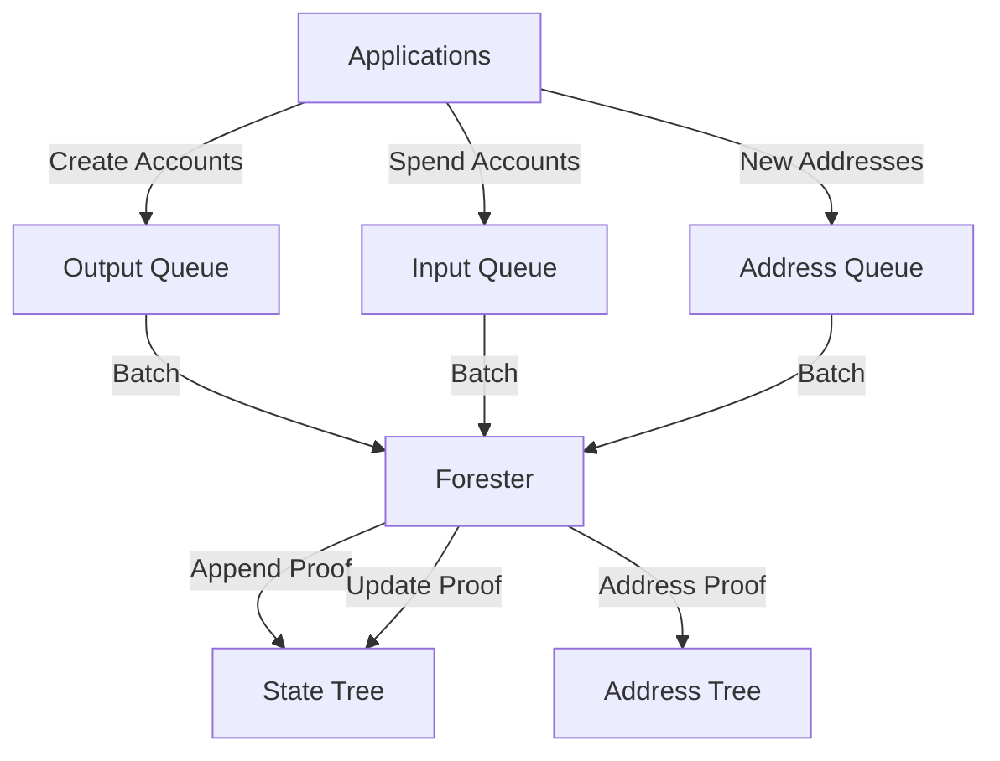

Effective queue management is critical for maintaining Light Protocol's tree liveness and ensuring timely processing of compressed account operations.

## Queue Architecture

Light Protocol uses separate queues for different tree operations:



### Queue Types

**State Tree Queues**

| Queue | Operation | Items | Purpose |
|-------|-----------|-------|----------|
| Input (V2) | Nullify | Nullifier hashes | Spend compressed accounts |
| Output (V2) | Append | Leaf hashes | Create compressed accounts |
| V1 Queue | Mixed | Nullifiers + leaves | Legacy single-item processing |

**Address Tree Queues**

| Queue | Operation | Items | Purpose |
|-------|-----------|-------|----------|
| Address (V2) | Append | Addresses + proofs | Ensure address uniqueness |
| V1 Queue | Append | Addresses | Legacy single-item processing |

## V2 Queue Structure

V2 queues use a batched structure for efficient processing:

### Batch Metadata

```rust
pub struct BatchMetadata {
    pub next_index: u64,              // Total items ever added
    pub pending_batch_index: u64,     // Next batch to process
    pub zkp_batch_size: u64,          // Items per batch
    pub batches: Vec<Batch>,          // Active batches
}

pub struct Batch {
    pub state: BatchState,            // Fill, Inserted, Proven, Full
    pub num_inserted: u64,            // Completed ZK batches
    pub current_index: u64,           // Current ZK batch index
    pub zkp_batch_size: u64,          // Items per ZK proof
}
```

### Batch States

<Steps>
  <Step title="Fill">
    Batch is actively receiving new items from applications
  </Step>
  <Step title="Inserted">
    Batch is full and ready for ZK proof generation
  </Step>
  <Step title="Proven">
    ZK proof generated but not yet submitted on-chain
  </Step>
  <Step title="Full">
    Batch is complete, all proofs submitted successfully
  </Step>
</Steps>

## Queue Processing Strategy

### V2 State Tree Processing

The forester processes state trees with separate strategies for input and output queues:

#### Output Queue (Append)

<CodeGroup>
```rust Fetch Batches
// Query pending batches from output queue
let pending_batches = indexer
    .get_pending_batches(output_queue_pubkey)
    .await?;

// Process up to max_batches_per_tree
for batch in pending_batches.iter().take(max_batches_per_tree) {
    process_append_batch(batch).await?;
}
```

```rust Build Circuit Inputs
// Fetch batch data
let batch_data = fetch_batch_leaves(
    output_queue_pubkey,
    batch.batch_index,
    batch.zkp_batch_size
).await?;

// Build circuit inputs
let circuit_inputs = BatchAppendInputs {
    old_root,
    new_root,
    leaves: batch_data.leaves,
    old_leaves: vec![BigInt::zero(); batch_size],
    start_index: batch.start_index,
    merkle_proofs: fetch_merkle_proofs(&leaves).await?,
};
```

```rust Submit Transaction
// Request proof from prover
let (proof, new_root) = prover_client
    .generate_batch_append_proof(circuit_inputs)
    .await?;

// Create and submit transaction
let instruction = create_batch_append_instruction(
    batch.batch_index,
    proof,
    new_root,
    output_queue_pubkey,
    merkle_tree_pubkey,
);

submit_and_confirm_transaction(instruction).await?;
```
</CodeGroup>

#### Input Queue (Nullify)

<CodeGroup>
```rust Fetch Batches
// Query pending batches from input queue (on tree account)
let merkle_tree = fetch_merkle_tree_account(tree_pubkey).await?;
let pending_batches = merkle_tree.queue_batches.batches
    .iter()
    .filter(|b| b.state == BatchState::Inserted)
    .collect();
```

```rust Query Merkle Proofs
// For nullification, we need Merkle proofs for each item
let batch_items = fetch_batch_items(
    tree_pubkey,
    batch.batch_index,
    batch.zkp_batch_size
).await?;

// Query proofs from indexer
let proofs = indexer
    .get_multiple_compressed_account_proofs(
        &batch_items.leaf_indices
    )
    .await?;
```

```rust Build and Submit
// Build circuit inputs with proofs
let circuit_inputs = BatchUpdateInputs {
    old_root,
    new_root,
    leaves: batch_items.leaves,
    old_leaves: proofs.old_leaves,
    merkle_proofs: proofs.proofs,
    path_indices: batch_items.indices,
    tx_hashes: batch_items.tx_hashes,
};

// Generate proof and submit
let (proof, new_root) = prover_client
    .generate_batch_update_proof(circuit_inputs)
    .await?;

submit_batch_nullify_transaction(proof, new_root).await?;
```
</CodeGroup>

### V2 Address Tree Processing

<CodeGroup>
```rust Fetch and Process
// Query pending address batches
let merkle_tree = fetch_address_tree_account(tree_pubkey).await?;
let pending_batches = merkle_tree.queue_batches.batches
    .iter()
    .filter(|b| b.state == BatchState::Inserted)
    .collect();

for batch in pending_batches.iter().take(max_batches_per_tree) {
    process_address_batch(batch).await?;
}
```

```rust Build Inputs
// Fetch batch addresses
let batch_data = fetch_batch_addresses(
    tree_pubkey,
    batch.batch_index,
    batch.zkp_batch_size
).await?;

// Query low element proofs from indexer
let low_element_proofs = indexer
    .get_multiple_new_address_proofs(
        tree_pubkey,
        &batch_data.addresses
    )
    .await?;

// Build circuit inputs
let circuit_inputs = BatchAddressAppendInputs {
    old_root,
    new_root,
    addresses: batch_data.addresses,
    low_element_values: low_element_proofs.values,
    low_element_indices: low_element_proofs.indices,
    low_element_proofs: low_element_proofs.proofs,
    ...
};
```
</CodeGroup>

## Batch Optimization

### Batch Size Selection

Choose batch sizes based on workload characteristics:

| Batch Size | Proof Time | Throughput | Best For |
|-----------|-----------|------------|----------|
| 10 | ~1-2s | Low | Testing, development |
| 100 | ~3-5s | Medium | Moderate load |
| 500 | ~10-15s | High | High volume |

<Info>
Larger batches are more efficient but have higher latency. Choose based on your application's latency vs throughput requirements.
</Info>

### Concurrent Batch Processing

```bash
# Process multiple batches per tree in parallel
forester start \
  --max-batches-per-tree 4 \
  --transaction-max-concurrent-batches 20
```

**Recommendations**:
- `max-batches-per-tree`: 2-4 for most workloads
- `transaction-max-concurrent-batches`: 10-20 for balanced throughput
- Higher values increase resource usage (memory, RPC load)

### Proof Generation Pipeline

Optimize proof generation workflow:

<Steps>
  <Step title="Parallel Proof Requests">
    Submit multiple proof requests to the prover concurrently
  </Step>
  <Step title="Pipeline Stages">
    While proofs are generating, fetch data for next batches
  </Step>
  <Step title="Transaction Batching">
    Submit transactions as soon as proofs are ready (don't wait for all)
  </Step>
  <Step title="Async Confirmation">
    Poll transaction confirmations in parallel
  </Step>
</Steps>

## Liveness Monitoring

### Queue Depth Tracking

Monitor pending items across all queues:

```rust
// Fetch queue status
let state_output_info = get_state_v2_output_queue_info(
    &mut rpc,
    &output_queue_pubkey
).await?;

let state_input_info = parse_state_v2_queue_info(
    &merkle_tree,
    &mut output_queue_data
).await?;

let address_info = get_address_v2_queue_info(
    &mut rpc,
    &address_tree_pubkey
).await?;

// Calculate pending items
let total_pending = 
    state_output_info.output_pending_batches * batch_size +
    state_input_info.input_pending_batches * batch_size +
    address_info.input_pending_batches * batch_size;
```

### Liveness Metrics

**Queue Processing Rate**
```promql
rate(forester_queue_items_processed_total[5m])
```

**Queue Depth**
```promql
forester_queue_pending_items{tree_type="state", tree_version="v2"}
```

**Processing Lag**
```promql
(
  forester_queue_next_index - 
  forester_queue_completed_index
) / forester_queue_processing_rate
```

**Target Metrics**:
- Queue depth: < 1000 items
- Processing rate: > 100 items/sec
- Processing lag: < 60 seconds

### Alert Rules

```yaml
groups:
  - name: forester_liveness
    rules:
      - alert: QueueDepthHigh
        expr: forester_queue_pending_items > 5000
        for: 5m
        annotations:
          summary: "High queue depth on {{ $labels.tree_type }}"
      
      - alert: ProcessingStalled
        expr: rate(forester_queue_items_processed_total[5m]) < 10
        for: 10m
        annotations:
          summary: "Forester processing rate dropped"
      
      - alert: LowSolBalance
        expr: forester_sol_balance < 0.1
        for: 1m
        annotations:
          summary: "Forester SOL balance critically low"
```

## Cache Management

The forester uses caching to prevent duplicate processing:

### Transaction Deduplication Cache

```bash
forester start --tx-cache-ttl-seconds 180
```

**Purpose**: Prevent re-processing the same transaction signature

**TTL**: 180 seconds (3 minutes) default

**Use Case**: Multiple foresters processing same queues

### Operations Cache

```bash
forester start --ops-cache-ttl-seconds 180
```

**Purpose**: Cache batch operation status to avoid redundant queries

**TTL**: 180 seconds default

**Use Case**: Reduce indexer load for frequently checked batches

<Warning>
Caches must expire before epoch transitions to prevent stale data. Keep TTL below epoch duration.
</Warning>

## Proof Result Caching

The forester implements proof caching to avoid regenerating identical proofs:

```rust
// Shared proof cache across processors
let proof_cache = Arc::new(DashMap::new());

// Before generating proof, check cache
let cache_key = hash(&circuit_inputs);
if let Some(cached_proof) = proof_cache.get(&cache_key) {
    return Ok(cached_proof.clone());
}

// Generate proof and cache result
let proof = prover.generate_proof(circuit_inputs).await?;
proof_cache.insert(cache_key, proof.clone());
```

**Benefits**:
- Avoid duplicate proof generation
- Reduce prover load
- Faster processing for common patterns

## Error Handling

### Transient Errors

Handle temporary failures with retries:

```rust
// RPC errors
match error {
    RpcError::Timeout(_) | 
    RpcError::ConnectionError(_) => {
        // Retry with exponential backoff
        retry_with_backoff(operation).await?
    },
    _ => return Err(error),
}

// Prover errors
match error {
    ProverError::JobNotFound(_) => {
        // Resubmit proof request
        submit_proof_request(inputs).await?
    },
    ProverError::Timeout(_) => {
        // Increase timeout and retry
        retry_with_longer_timeout(inputs).await?
    },
    _ => return Err(error),
}
```

### Permanent Errors

Skip invalid operations and log for investigation:

```rust
match error {
    // Constraint errors indicate invalid inputs
    ProverError::ConstraintError(_) => {
        error!("Invalid circuit inputs for batch {}: {}", batch_index, error);
        // Skip this batch, don't retry
        return Ok(());
    },
    
    // Tree state errors
    ForesterError::TreeFull | 
    ForesterError::TreeNeedsRollover => {
        warn!("Tree {} needs rollover", tree_pubkey);
        // Attempt rollover or skip tree
        attempt_rollover(tree_pubkey).await?;
    },
    
    _ => return Err(error),
}
```

## Tree Rollover

When trees reach capacity, they must be rolled over:

### Rollover Detection

```rust
if is_tree_ready_for_rollover(&tree_account, current_slot) {
    info!("Tree {} ready for rollover", tree_pubkey);
    perform_tree_rollover(tree_pubkey).await?;
}
```

### Rollover Process

<Steps>
  <Step title="Detect Rollover">
    Check if tree has reached capacity or rollover threshold
  </Step>
  <Step title="Create New Tree">
    Initialize new tree account with same parameters
  </Step>
  <Step title="Update Registry">
    Register new tree in the protocol registry
  </Step>
  <Step title="Migrate Queue">
    Point queue processing to new tree
  </Step>
  <Step title="Mark Old Tree">
    Set old tree as read-only, prevent new insertions
  </Step>
</Steps>

## Priority Fee Management

Dynamic priority fees ensure transactions land during congestion:

```bash
forester start --enable-priority-fees true
```

### Fee Calculation Strategy

```rust
// Query recent prioritization fees
let recent_fees = rpc.get_recent_prioritization_fees(&[]).await?;

// Calculate percentile-based fee
let p75_fee = calculate_percentile(&recent_fees, 75);
let p90_fee = calculate_percentile(&recent_fees, 90);

// Use higher fee for critical transactions
let priority_fee = if is_critical {
    p90_fee
} else {
    p75_fee
};

// Add to transaction
transaction.add_priority_fee(priority_fee);
```

<Info>
Enable priority fees in production to ensure timely transaction processing during network congestion.
</Info>

## Multi-Forester Coordination

Run multiple foresters for redundancy and load distribution:

### Strategies

**1. Tree-Based Sharding**
```bash
# Forester A: Process first half of trees
forester start \
  --tree-id TREE_1 \
  --tree-id TREE_2

# Forester B: Process second half
forester start \
  --tree-id TREE_3 \
  --tree-id TREE_4
```

**2. Authority-Based Sharding**
```bash
# Forester A: Process authority 1 trees
forester start --group-authority AUTHORITY_1

# Forester B: Process authority 2 trees  
forester start --group-authority AUTHORITY_2
```

**3. Redundant Processing**
```bash
# Both foresters process all trees
# Transaction deduplication prevents conflicts
forester start --tx-cache-ttl-seconds 300  # Forester A
forester start --tx-cache-ttl-seconds 300  # Forester B
```

### Coordination Mechanisms

**Transaction Deduplication**
- Each forester checks cache before submitting
- Recent transaction signatures stored in shared cache
- Prevents duplicate submissions

**Epoch Slot Assignment**
- Foresters assigned specific time slots in epoch
- Only process trees during assigned slots
- Natural coordination through protocol design

## Best Practices

<CardGroup cols={2}>
  <Card title="Monitoring" icon="chart-line">
    - Track queue depth continuously
    - Alert on processing rate drops
    - Monitor proof generation times
    - Watch SOL balance closely
  </Card>
  
  <Card title="Performance" icon="gauge">
    - Use appropriate batch sizes
    - Enable priority fees in production
    - Tune concurrent batch processing
    - Cache proof results
  </Card>
  
  <Card title="Reliability" icon="shield-check">
    - Run multiple forester instances
    - Handle transient errors gracefully
    - Implement transaction deduplication
    - Auto-recover from failures
  </Card>
  
  <Card title="Resource Management" icon="server">
    - Monitor memory usage
    - Tune RPC pool size
    - Limit concurrent operations
    - Use cache TTLs appropriately
  </Card>
</CardGroup>

## Next Steps

<CardGroup cols={2}>
  <Card title="Prover Setup" icon="microchip" href="/prover/server">
    Optimize prover configuration for your workload
  </Card>
  <Card title="Monitoring" icon="chart-line" href="/forester/running#monitoring-setup">
    Set up comprehensive monitoring and alerting
  </Card>
</CardGroup>