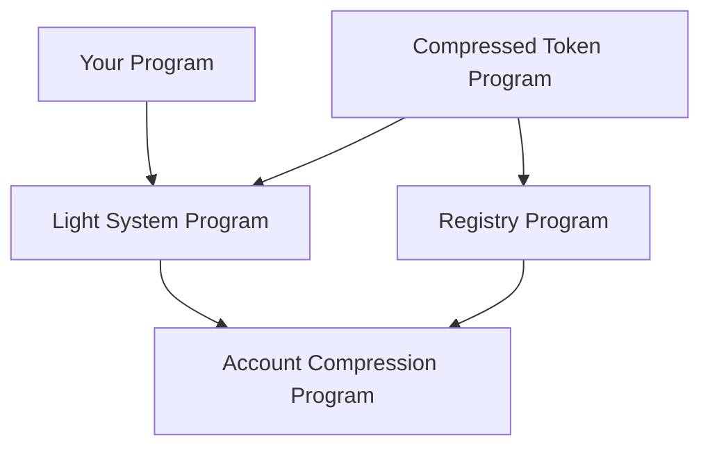

Light Protocol consists of four core on-chain programs that work together to enable ZK compression on Solana. These programs handle state compression, validation, token operations, and access control.

## Core Programs

<CardGroup cols={2}>
  <Card title="Account Compression" icon="folder-tree" href="/programs/account-compression">
    Owns and manages Merkle tree accounts for compressed state
  </Card>
  <Card title="Light System" icon="shield-check" href="/programs/system">
    Validates compressed account operations and state transitions
  </Card>
  <Card title="Compressed Token" icon="coins" href="/programs/compressed-token">
    SPL Token-compatible program for compressed tokens
  </Card>
  <Card title="Registry" icon="database" href="/programs/registry">
    Protocol configuration and forester access control
  </Card>
</CardGroup>

## Program Architecture

The programs follow a layered architecture:



### Interaction Flow

1. **Application Layer**: Your program or the Compressed Token program creates compressed accounts
2. **Validation Layer**: Light System program validates state transitions and ZK proofs
3. **Storage Layer**: Account Compression program manages Merkle trees and state
4. **Control Layer**: Registry program handles access control and forester coordination

## Program Responsibilities

<AccordionGroup>
  <Accordion title="Account Compression Program">
    - Owns all Merkle tree accounts (state trees and address trees)
    - Performs tree operations (append, nullify, update)
    - Manages tree rollovers when capacity is reached
    - Handles batched operations for efficiency
    - Validates program access through registered program PDAs
  </Accordion>

  <Accordion title="Light System Program">
    - Validates compressed account ownership and signatures
    - Verifies ZK proofs for state transitions
    - Manages CPI context accounts for cross-program calls
    - Enforces state transition rules
    - Coordinates with Account Compression for tree updates
  </Accordion>

  <Accordion title="Compressed Token Program">
    - Implements SPL Token-compatible interface for compressed tokens
    - Manages both compressed tokens (in Merkle trees) and CToken accounts (decompressed)
    - Handles compression/decompression operations
    - Supports Token-2022 extensions (metadata, transfer fees, etc.)
    - Manages rent for compressible accounts
  </Accordion>

  <Accordion title="Registry Program">
    - Stores protocol configuration (epochs, fees, network parameters)
    - Manages forester registration and work tracking
    - Wraps Account Compression instructions with access control
    - Handles compressible config accounts for rent management
    - Coordinates decentralized tree maintenance
  </Accordion>
</AccordionGroup>

## Program IDs

<CodeGroup>
```rust Rust
use solana_sdk::pubkey::Pubkey;

pub const ACCOUNT_COMPRESSION_ID: Pubkey = 
    solana_sdk::pubkey!("compr6CUsB5m2jS4Y3831ztGSTnDpnKJTKS95d64XVq");

pub const LIGHT_SYSTEM_ID: Pubkey = 
    solana_sdk::pubkey!("SySTEM1eSU2p4BGQfQpimFEWWSC1XDFeun3Nqzz3rT7");

pub const COMPRESSED_TOKEN_ID: Pubkey = 
    solana_sdk::pubkey!("cTokenmWW8bLPjZEBAUgYy3zKxQZW6VKi7bqNFEVv3m");

pub const REGISTRY_ID: Pubkey = 
    solana_sdk::pubkey!("Lighton6oQpVkeewmo2mcPTQQp7kYHr4fWpAgJyEmDX");
```

```typescript TypeScript
import { PublicKey } from '@solana/web3.js';

export const ACCOUNT_COMPRESSION_ID = new PublicKey(
  'compr6CUsB5m2jS4Y3831ztGSTnDpnKJTKS95d64XVq'
);

export const LIGHT_SYSTEM_ID = new PublicKey(
  'SySTEM1eSU2p4BGQfQpimFEWWSC1XDFeun3Nqzz3rT7'
);

export const COMPRESSED_TOKEN_ID = new PublicKey(
  'cTokenmWW8bLPjZEBAUgYy3zKxQZW6VKi7bqNFEVv3m'
);

export const REGISTRY_ID = new PublicKey(
  'Lighton6oQpVkeewmo2mcPTQQp7kYHr4fWpAgJyEmDX'
);
```
</CodeGroup>

## Security

All Light Protocol programs have been audited:

- **OtterSec** - Programs audit #1
- **Neodyme** - Programs audit #2  
- **Zellic** - Programs audit #3
- **Reilabs** - Circuits formal verification

View full audit reports in the [Light Protocol repository](https://github.com/Lightprotocol/light-protocol/tree/main/audits).

## Verifiable Builds

All programs are deployed with verifiable builds using `solana-verify`:

<CodeGroup>
```bash Account Compression
solana-verify verify-from-repo \
  --program-id compr6CUsB5m2jS4Y3831ztGSTnDpnKJTKS95d64XVq \
  -u mainnet \
  --library-name account_compression \
  --commit-hash 1cb0f067b3d2d4e012e76507c077fc348eb88091 \
  https://github.com/Lightprotocol/light-protocol
```

```bash Light System
solana-verify verify-from-repo \
  --program-id SySTEM1eSU2p4BGQfQpimFEWWSC1XDFeun3Nqzz3rT7 \
  -u mainnet \
  --library-name light_system_program \
  --commit-hash 1cb0f067b3d2d4e012e76507c077fc348eb88091 \
  https://github.com/Lightprotocol/light-protocol
```

```bash Compressed Token
solana-verify verify-from-repo \
  --program-id cTokenmWW8bLPjZEBAUgYy3zKxQZW6VKi7bqNFEVv3m \
  -u mainnet \
  --library-name light_compressed_token \
  --commit-hash 1cb0f067b3d2d4e012e76507c077fc348eb88091 \
  https://github.com/Lightprotocol/light-protocol
```

```bash Registry
solana-verify verify-from-repo \
  --program-id Lighton6oQpVkeewmo2mcPTQQp7kYHr4fWpAgJyEmDX \
  -u mainnet \
  --library-name light_registry \
  --commit-hash 1cb0f067b3d2d4e012e76507c077fc348eb88091 \
  https://github.com/Lightprotocol/light-protocol
```
</CodeGroup>

## Next Steps

<CardGroup cols={2}>
  <Card title="Build Custom Program" icon="code" href="/guides/custom-programs">
    Learn how to build programs that use ZK compression
  </Card>
  <Card title="Program Examples" icon="book" href="https://github.com/Lightprotocol/program-examples">
    Explore example programs and templates
  </Card>
</CardGroup>