The Registry program manages Light Protocol's configuration, coordinates forester operations, and wraps Account Compression instructions with access control for decentralized tree maintenance.

## Program ID

```
Lighton6oQpVkeewmo2mcPTQQp7kYHr4fWpAgJyEmDX
```

## Overview

The Registry program serves three primary functions:

1. **Protocol Configuration**: Stores network parameters, epoch settings, and fees
2. **Forester Coordination**: Manages forester registration, work tracking, and rewards
3. **Access Control**: Wraps Account Compression instructions with eligibility checks

## Key Features

<CardGroup cols={2}>
  <Card title="Protocol Config" icon="gear">
    Network-wide settings and parameters
  </Card>
  <Card title="Forester Epochs" icon="calendar">
    Time-based registration and work tracking
  </Card>
  <Card title="Wrapper Instructions" icon="shield">
    Access-controlled tree operations
  </Card>
  <Card title="Rent Management" icon="money-bill-wave">
    Compressible config accounts
  </Card>
</CardGroup>

## Account Types

### Protocol Config PDA

Stores global protocol configuration.

<ParamField path="authority" type="Pubkey" required>
  Protocol authority that can update config
</ParamField>

<ParamField path="bump" type="u8" required>
  PDA bump seed
</ParamField>

<ParamField path="config" type="ProtocolConfig" required>
  Configuration parameters:
  - `genesis_slot`: Protocol start slot
  - `active_phase_length`: Slots per active phase
  - `registration_phase_length`: Slots for forester registration
  - `report_work_phase_length`: Slots for work reporting
  - `network_fee`: Base network fee in lamports
  - `slot_length`: Seconds per slot
</ParamField>

**Derivation:** Seeds `[b"protocol_config_pda_v1", authority]`

**Source:** `programs/registry/src/protocol_config/state.rs`

### Forester Epoch PDA

Tracks forester registration and work for an epoch.

<ParamField path="authority" type="Pubkey" required>
  Forester authority
</ParamField>

<ParamField path="epoch" type="u64" required>
  Epoch number
</ParamField>

<ParamField path="total_work" type="u64" required>
  Work units completed this epoch
</ParamField>

<ParamField path="work_by_tree" type="HashMap<Pubkey, u64>">
  Work breakdown per tree
</ParamField>

<ParamField path="registration_slot" type="u64" required>
  Slot when forester registered
</ParamField>

<ParamField path="finalized" type="bool" required>
  Whether epoch is finalized
</ParamField>

**Derivation:** Seeds `[b"forester_epoch_pda", authority, epoch.to_le_bytes()]`

**Source:** `programs/registry/src/epoch/state.rs`

### Compressible Config

Configuration for compressible token accounts (rent management).

<ParamField path="rent_sponsor" type="Pubkey" required>
  Address that sponsored the rent
</ParamField>

<ParamField path="config_state" type="CompressibleConfigState" required>
  State: Active, Deprecated, or Inactive
</ParamField>

<ParamField path="rent_authority" type="Option<Pubkey>">
  Authority that can claim rent back
</ParamField>

<ParamField path="compression_incentive" type="u64" required>
  Incentive paid for compression (in lamports)
</ParamField>

<ParamField path="decompression_incentive" type="u64" required>
  Incentive paid for decompression
</ParamField>

<ParamField path="slot_length" type="u64" required>
  Duration accounts must stay decompressed (in slots)
</ParamField>

<ParamField path="counter" type="u64" required>
  Counter for deriving unique config addresses
</ParamField>

**Derivation:** Seeds `[b"compressible_config", rent_sponsor, counter.to_le_bytes()]`

**Source:** `program-libs/compressible/src/config.rs`

## Core Instructions

### Protocol Configuration

<AccordionGroup>
  <Accordion title="initialize_protocol_config" icon="rocket">
    Initializes the protocol config PDA. Can only be called once.

    **Accounts:**
    - `authority` (signer): Protocol authority
    - `protocol_config_pda` (writable): PDA to initialize
    - `system_program`

    **Parameters:**
    - `bump`: PDA bump seed
    - `protocol_config`: Configuration parameters

    **Requirements:**
    - Must be signed by program account keypair during deployment
    - Can only be initialized once

    **Source:** `programs/registry/src/protocol_config/initialize.rs`
  </Accordion>

  <Accordion title="update_protocol_config" icon="pen-to-square">
    Updates protocol configuration.

    **Accounts:**
    - `authority` (signer): Current protocol authority
    - `protocol_config_pda` (writable): Config to update
    - `new_authority`: Optional new authority

    **Parameters:**
    - `protocol_config`: New configuration (optional)

    **Restrictions:**
    - Cannot change `genesis_slot`
    - Cannot change `active_phase_length` (would break epoch calculations)

    **Source:** `programs/registry/src/protocol_config/update.rs`
  </Accordion>
</AccordionGroup>

### Forester Management

<AccordionGroup>
  <Accordion title="register_epoch" icon="user-plus">
    Registers a forester for the current epoch.

    **Accounts:**
    - `authority` (signer): Forester authority
    - `forester_epoch_pda` (writable): PDA to create
    - `protocol_config_pda`: Protocol config
    - `system_program`

    **Process:**
    1. Calculates current epoch from slot and config
    2. Checks registration is during registration phase
    3. Creates forester epoch PDA for this epoch

    **Requirements:**
    - Must be called during registration phase
    - One registration per epoch per forester

    **Source:** `programs/registry/src/epoch/register_epoch.rs`
  </Accordion>

  <Accordion title="report_work" icon="chart-line">
    Reports work completed by a forester (called by wrapper instructions).

    **Accounts:**
    - `forester_epoch_pda` (writable): Forester's epoch PDA
    - `tree_account`: Tree work was performed on

    **Parameters:**
    - `work_units`: Amount of work to record

    **Process:**
    1. Validates epoch is active
    2. Increments `total_work`
    3. Updates `work_by_tree` for the specific tree

    **Source:** `programs/registry/src/epoch/report_work.rs`
  </Accordion>

  <Accordion title="finalize_registration" icon="flag-checkered">
    Finalizes a forester's epoch registration for rewards.

    **Accounts:**
    - `authority` (signer): Forester authority
    - `forester_epoch_pda` (writable): Epoch PDA to finalize
    - `protocol_config_pda`: Protocol config

    **Requirements:**
    - Must be called during report work phase
    - Can only finalize once per epoch

    **Effect:** Marks epoch as finalized, enabling reward distribution

    **Source:** `programs/registry/src/epoch/finalize_registration.rs`
  </Accordion>
</AccordionGroup>

### Compressible Config Management

<AccordionGroup>
  <Accordion title="create_compressible_config_counter" icon="hashtag">
    Creates a counter account for generating unique config addresses.

    **Accounts:**
    - `rent_sponsor` (signer): Sponsor who will own configs
    - `counter_account` (writable): Counter PDA to create
    - `system_program`

    **Derivation:** Seeds `[b"compressible_config_counter", rent_sponsor]`

    **Source:** `programs/registry/src/compressible/create_config_counter.rs`
  </Accordion>

  <Accordion title="create_compressible_config" icon="file-plus">
    Creates a new compressible config.

    **Accounts:**
    - `rent_sponsor` (signer): Config owner
    - `counter_account` (writable): Counter to increment
    - `compressible_config` (writable): Config to create
    - `system_program`

    **Parameters:**
    - `config_data`: Configuration (rent authority, incentives, slot length)

    **Process:**
    1. Increments counter
    2. Derives config PDA with new counter value
    3. Initializes config with provided data

    **Source:** `programs/registry/src/compressible/create_config.rs`
  </Accordion>

  <Accordion title="update_compressible_config" icon="wrench">
    Updates an existing compressible config.

    **Accounts:**
    - `rent_sponsor` (signer): Config owner
    - `compressible_config` (writable): Config to update

    **Parameters:**
    - `config_state`: New state (Active, Deprecated, Inactive)
    - `rent_authority`: Optional new rent authority
    - `compression_incentive`: Optional new compression incentive
    - `decompression_incentive`: Optional new decompression incentive
    - `slot_length`: Optional new slot length

    **Source:** `programs/registry/src/compressible/update_config.rs`
  </Accordion>
</AccordionGroup>

### Wrapper Instructions (Access Control)

These instructions wrap Account Compression operations with forester eligibility checks.

<AccordionGroup>
  <Accordion title="Wrapper Pattern" icon="layer-group">
    All wrapper instructions follow the same pattern:

    1. **Load account** - Deserialize target account metadata
    2. **Check forester** - Validate authority and track work
    3. **Execute CPI** - Call Account Compression with PDA signer

    ```rust
    pub fn wrapper_instruction(
        ctx: Context<WrapperContext>,
        bump: u8,
        data: Vec<u8>,
    ) -> Result<()> {
        // 1. Load account
        let account = load_account(&ctx.accounts.target_account)?;
        
        // 2. Check forester eligibility
        check_forester(
            &account.metadata,
            ctx.accounts.authority.key(),
            &mut ctx.accounts.registered_forester_pda,
            work_units,
        )?;
        
        // 3. Execute CPI
        process_wrapper_cpi(&ctx, bump, data)
    }
    ```
  </Accordion>

  <Accordion title="batch_append" icon="file-arrow-down">
    Wraps Account Compression's `batch_append` with access control.

    **Work Units:** Based on batch size from queue metadata

    **Source:** `programs/registry/src/account_compression_cpi/batch_append.rs`
  </Accordion>

  <Accordion title="batch_nullify" icon="trash-can">
    Wraps `batch_nullify` with forester eligibility check.

    **Work Units:** Based on batch size

    **Source:** `programs/registry/src/account_compression_cpi/batch_nullify.rs`
  </Accordion>

  <Accordion title="batch_update_address_tree" icon="arrows-rotate">
    Wraps batched address tree updates.

    **Source:** `programs/registry/src/account_compression_cpi/batch_update_address_tree.rs`
  </Accordion>

  <Accordion title="nullify" icon="eraser">
    Wraps single leaf nullification.

    **Work Units:** `DEFAULT_WORK_V1` constant

    **Source:** `programs/registry/src/account_compression_cpi/nullify.rs`
  </Accordion>

  <Accordion title="update_address_merkle_tree" icon="pen-to-square">
    Wraps single address insertion.

    **Work Units:** `DEFAULT_WORK_V1` constant

    **Source:** `programs/registry/src/account_compression_cpi/update_address_tree.rs`
  </Accordion>

  <Accordion title="rollover_state_merkle_tree_and_queue" icon="rotate">
    Wraps state tree rollover.

    **Source:** `programs/registry/src/account_compression_cpi/rollover_state_tree.rs`
  </Accordion>

  <Accordion title="rollover_batched_state_merkle_tree" icon="arrows-spin">
    Wraps batched state tree rollover.

    **Source:** `programs/registry/src/account_compression_cpi/rollover_batched_state_tree.rs`
  </Accordion>

  <Accordion title="rollover_batched_address_merkle_tree" icon="sync">
    Wraps batched address tree rollover.

    **Source:** `programs/registry/src/account_compression_cpi/rollover_batched_address_tree.rs`
  </Accordion>

  <Accordion title="initialize_batched_state_merkle_tree" icon="tree">
    Wraps batched state tree initialization.

    **Source:** `programs/registry/src/account_compression_cpi/initialize_batched_state_tree.rs`
  </Accordion>

  <Accordion title="initialize_batched_address_merkle_tree" icon="address-book">
    Wraps batched address tree initialization.

    **Source:** `programs/registry/src/account_compression_cpi/initialize_batched_address_tree.rs`
  </Accordion>

  <Accordion title="migrate_state" icon="right-left">
    Wraps state migration between trees.

    **Source:** `programs/registry/src/account_compression_cpi/migrate_state.rs`
  </Accordion>
</AccordionGroup>

### Compressible Token Operations

<AccordionGroup>
  <Accordion title="compress_and_close" icon="compress">
    Wraps Compressed Token's compress and close operation.

    **Process:**
    1. Validates compressible config is not inactive
    2. Executes compression via CPI
    3. Handles rent distribution

    **Source:** `programs/registry/src/compressible/compress_and_close.rs`
  </Accordion>

  <Accordion title="claim" icon="hand-holding-dollar">
    Wraps Compressed Token's claim instruction.

    **Requirements:**
    - Config must not be inactive
    - Account must be compressible

    **Source:** `programs/registry/src/compressible/claim.rs`
  </Accordion>

  <Accordion title="withdraw_funding_pool" icon="money-bill-transfer">
    Wraps Compressed Token's withdraw funding pool instruction.

    **Source:** `programs/registry/src/compressible/withdraw_funding_pool.rs`
  </Accordion>
</AccordionGroup>

## Forester Eligibility System

### Epoch Phases

Each epoch consists of three phases:

```mermaid
gantt
    title Forester Epoch Phases
    dateFormat X
    axisFormat %s
    
    section Epoch
    Registration Phase: 0, 1000
    Active Phase: 1000, 5000
    Report Work Phase: 5000, 6000
```



1. **Registration Phase**: Foresters register for the epoch
2. **Active Phase**: Foresters perform work on trees
3. **Report Work Phase**: Foresters finalize registration and receive rewards

### Work Tracking

Work is tracked per operation:

| Operation | Work Units |
|-----------|------------|
| Batch append | Batch size |
| Batch nullify | Batch size |
| Batch address update | Batch size |
| Single nullify | DEFAULT_WORK_V1 (1) |
| Single address update | DEFAULT_WORK_V1 (1) |
| Tree rollover | DEFAULT_WORK_V1 (1) |

### Eligibility Check

The `check_forester` function validates operations:

**With Forester PDA:**
- Validates epoch registration
- Checks authority matches registered forester
- Tracks work units
- Requires network fee payment

**Without Forester PDA (Private Trees):**
- Checks authority matches tree's designated forester
- No work tracking
- No network fee required

## Usage Examples

### Registering as a Forester

```rust
use light_registry::cpi::accounts::RegisterEpoch;
use anchor_lang::prelude::*;

#[derive(Accounts)]
pub struct RegisterForester<'info> {
    #[account(mut)]
    pub authority: Signer<'info>,
    
    #[account(mut)]
    /// CHECK: Will be created
    pub forester_epoch_pda: AccountInfo<'info>,
    
    pub protocol_config_pda: Account<'info, ProtocolConfigPda>,
    
    pub light_registry_program: Program<'info, LightRegistry>,
    pub system_program: Program<'info, System>,
}

pub fn register_as_forester(
    ctx: Context<RegisterForester>,
) -> Result<()> {
    let cpi_accounts = RegisterEpoch {
        authority: ctx.accounts.authority.to_account_info(),
        forester_epoch_pda: ctx.accounts.forester_epoch_pda.to_account_info(),
        protocol_config_pda: ctx.accounts.protocol_config_pda.to_account_info(),
        system_program: ctx.accounts.system_program.to_account_info(),
    };
    
    let cpi_ctx = CpiContext::new(
        ctx.accounts.light_registry_program.to_account_info(),
        cpi_accounts,
    );
    
    light_registry::cpi::register_epoch(cpi_ctx)
}
```

### Creating a Compressible Config

```typescript
import { 
  createCompressibleConfig,
  CompressibleConfigState 
} from '@lightprotocol/compressed-token';
import { PublicKey } from '@solana/web3.js';

const rentSponsor = wallet.publicKey;
const rentAuthority = new PublicKey('...');

const { config, signature } = await createCompressibleConfig(
  rpc,
  payer,
  rentSponsor,
  {
    configState: CompressibleConfigState.Active,
    rentAuthority: rentAuthority,
    compressionIncentive: 1_000_000, // 0.001 SOL
    decompressionIncentive: 500_000,  // 0.0005 SOL
    slotLength: 1000,                 // 1000 slots (~400 seconds)
  }
);

console.log(`Config created: ${config}`);
```

## Error Codes

| Code | Name | Description |
|------|------|-------------|
| 5000 | InvalidEpoch | Epoch number invalid for current slot |
| 5001 | InvalidPhase | Operation not allowed in current phase |
| 5002 | ForesterNotRegistered | Forester not registered for epoch |
| 5003 | InvalidSigner | Signer doesn't match expected authority |
| 5004 | AlreadyFinalized | Epoch already finalized |
| 5005 | InvalidNetworkFee | Network fee payment incorrect |
| 5006 | InvalidConfigUpdate | Config update violates constraints |
| 5007 | ForesterDefined | Tree has forester but none provided |
| 5008 | ForesterUndefined | Tree has no forester but one provided |
| 5009 | CompressibleConfigInactive | Config state is inactive |

**Source:** `programs/registry/src/errors.rs`

## Source Code

View the full source code on GitHub:

- [Registry Program](https://github.com/Lightprotocol/light-protocol/tree/main/programs/registry)
- [Compressible Library](https://github.com/Lightprotocol/light-protocol/tree/main/program-libs/compressible)
- [Forester Service](https://github.com/Lightprotocol/light-protocol/tree/main/forester)

## Next Steps

<CardGroup cols={2}>
  <Card title="Run a Forester" icon="server" href="/forester/running">
    Learn how to run a forester node
  </Card>
  <Card title="Programs Overview" icon="folder-tree" href="/programs/overview">
    Back to programs overview
  </Card>
</CardGroup>