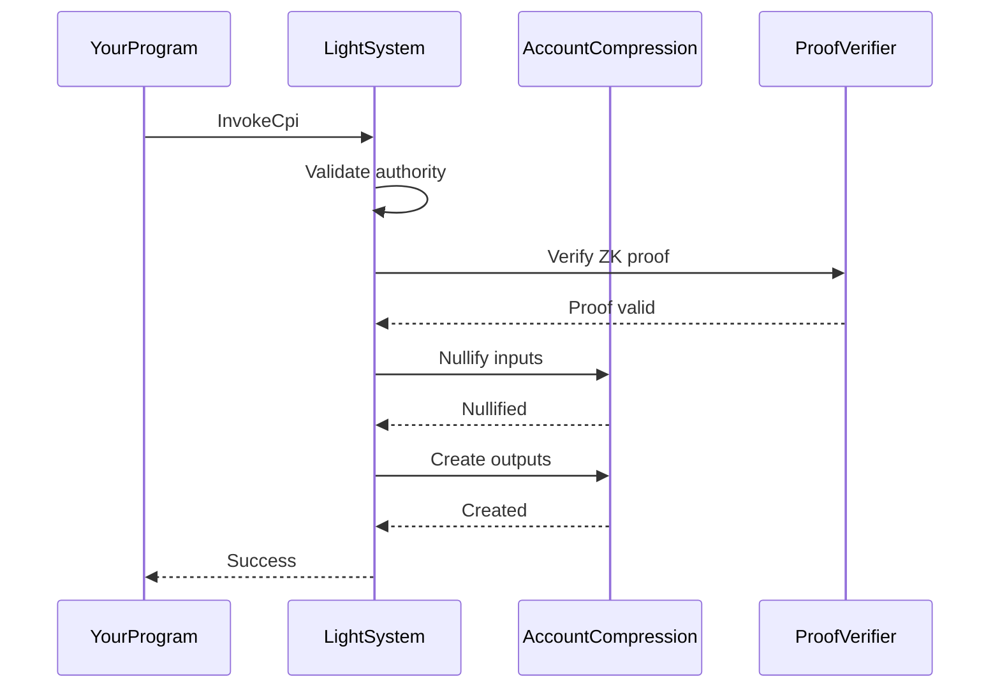

The Light System program is the validation layer of Light Protocol. It verifies compressed account operations, validates ZK proofs, and ensures state transitions follow protocol rules.

## Program ID

```
SySTEM1eSU2p4BGQfQpimFEWWSC1XDFeun3Nqzz3rT7
```

## Overview

The Light System program acts as the gateway for all compressed account operations. It coordinates between your program, the Account Compression program, and the ZK proof verification system.

## Key Responsibilities

<CardGroup cols={2}>
  <Card title="State Validation" icon="check-circle">
    Verifies compressed account ownership and signatures
  </Card>
  <Card title="Proof Verification" icon="shield-halved">
    Validates ZK proofs for state transitions
  </Card>
  <Card title="CPI Context" icon="link">
    Manages cross-program invocation contexts
  </Card>
  <Card title="Tree Coordination" icon="diagram-project">
    Coordinates with Account Compression for updates
  </Card>
</CardGroup>

## Core Instructions

### Invoke

Executes compressed account operations directly from user programs.

<ParamField path="instruction_data" type="InstructionDataInvoke" required>
  Contains all data for the compressed account operation:
  
  - `input_compressed_accounts_with_merkle_context`: Accounts being spent/nullified
  - `output_compressed_accounts`: New accounts being created
  - `relay_fee`: Optional fee for transaction relay
  - `compress_or_decompress_lamports`: Lamport transfer amount
  - `is_compress`: Whether operation compresses or decompresses
  - `proof`: Zero-knowledge proof for the state transition (optional)
</ParamField>

**Accounts:**
- `authority` (signer): Must own all input compressed accounts
- `registered_program_pda`: Proof that caller program is registered
- `noop_program`: Event logging program
- `account_compression_authority`: PDA authority for compression program
- `account_compression_program`: Account Compression program
- `sol_pool_pda`: Optional SOL pool for compression/decompression
- `decompression_recipient`: Optional recipient for decompressed lamports
- Remaining accounts: Merkle trees, nullifier queues, and address trees

**Process:**
1. Verifies authority owns all input compressed accounts
2. Validates ZK proof if provided
3. Nullifies input accounts in Merkle trees
4. Creates output accounts
5. Handles lamport compression/decompression

**Source:** `programs/system/src/lib.rs:94`

### InvokeCpi

Executes compressed account operations via CPI from another program.

<ParamField path="instruction_data" type="InstructionDataInvokeCpi" required>
  Similar to Invoke, but includes:
  
  - `invoking_program`: Program making the CPI call
  - `cpi_context_account`: Context account for the CPI
  - All fields from InstructionDataInvoke
</ParamField>

**Key Difference from Invoke:**
- Authority check is deferred to the invoking program
- Requires a CPI context account to track program state
- Enables composability between compressed programs

**Source:** `programs/system/src/lib.rs:119`

### InvokeCpiWithReadOnly

CPI invocation with read-only compressed account support.

<ParamField path="mode" type="AccountMode" required>
  Specifies which accounts are read-only:
  - `ReadOnly`: All accounts are read-only
  - `WriteOnly`: All accounts are writable
  - `Mixed`: Some accounts read-only, some writable
</ParamField>

**Use Case:** Efficiently read compressed account data without nullifying

**Source:** `programs/system/src/lib.rs:139`

### InvokeCpiWithAccountInfo

CPI invocation with additional account information for complex operations.

**Use Case:** Advanced operations requiring extra metadata

**Source:** `programs/system/src/lib.rs:155`

### InitializeCpiContextAccount

Creates a CPI context account for a program to use InvokeCpi.

**Accounts:**
- `fee_payer` (signer): Pays for account creation
- `cpi_context_account` (writable): Context account to initialize
- `associated_merkle_tree`: Tree the context is bound to

**Process:**
1. Derives PDA for CPI context account
2. Allocates account with sufficient space
3. Initializes context with program and tree information

**Source:** `programs/system/src/accounts/init_context_account.rs`

## Account Types

### CPI Context Account

Stores state for cross-program invocations.

<ParamField path="discriminator" type="[u8; 8]" required>
  Account type identifier
</ParamField>

<ParamField path="invoking_program" type="Pubkey" required>
  Program that created this context
</ParamField>

<ParamField path="merkle_tree" type="Pubkey" required>
  Associated Merkle tree for this context
</ParamField>

<ParamField path="bump" type="u8" required>
  PDA bump seed
</ParamField>

**Derivation:**
```rust
find_program_address(
    &[
        b"cpi_context",
        invoking_program.as_ref(),
        merkle_tree.as_ref(),
    ],
    &LIGHT_SYSTEM_PROGRAM_ID,
)
```

## State Validation Flow



## Usage in Custom Programs

### Basic Invoke Example

```rust
use light_system_program::{
    invoke::instruction::InvokeInstruction,
    InputCompressedAccountWithMerkleContext,
    OutputCompressedAccountWithPackedContext,
};
use anchor_lang::prelude::*;

#[derive(Accounts)]
pub struct CompressAccounts<'info> {
    pub authority: Signer<'info>,
    
    /// CHECK: Registered program PDA
    pub registered_program_pda: AccountInfo<'info>,
    
    /// CHECK: Noop program
    pub noop_program: AccountInfo<'info>,
    
    /// CHECK: Account compression authority
    pub account_compression_authority: AccountInfo<'info>,
    
    pub account_compression_program: Program<'info, AccountCompression>,
    
    pub light_system_program: Program<'info, LightSystemProgram>,
    
    /// Remaining accounts: trees, queues, etc.
}

pub fn compress_accounts(
    ctx: Context<CompressAccounts>,
    inputs: Vec<InputCompressedAccountWithMerkleContext>,
    outputs: Vec<OutputCompressedAccountWithPackedContext>,
    proof: Option<CompressedProof>,
) -> Result<()> {
    let instruction_data = InstructionDataInvoke {
        relay_fee: None,
        input_compressed_accounts_with_merkle_context: inputs,
        output_compressed_accounts: outputs,
        compress_or_decompress_lamports: None,
        is_compress: false,
        proof,
    };
    
    // Build accounts for Light System program
    let accounts = vec![
        AccountMeta::new_readonly(ctx.accounts.authority.key(), true),
        AccountMeta::new_readonly(ctx.accounts.registered_program_pda.key(), false),
        // ... additional accounts
    ];
    
    let instruction = Instruction {
        program_id: light_system_program::ID,
        accounts,
        data: instruction_data.try_to_vec()?,
    };
    
    invoke(&instruction, &ctx.accounts.to_account_infos())?;
    
    Ok(())
}
```

### InvokeCpi from Your Program

```rust
use light_system_program::{
    invoke_cpi::processor::CompressedCpiContext,
    sdk::compressed_account::CompressedAccount,
};

#[derive(Accounts)]
pub struct ProcessWithCpi<'info> {
    pub authority: Signer<'info>,
    
    #[account(mut)]
    /// CHECK: CPI context account
    pub cpi_context: AccountInfo<'info>,
    
    /// CHECK: Registered program PDA
    pub registered_program_pda: AccountInfo<'info>,
    
    pub light_system_program: Program<'info, LightSystemProgram>,
    
    pub account_compression_program: Program<'info, AccountCompression>,
    
    // ... remaining accounts
}

pub fn process_with_cpi(
    ctx: Context<ProcessWithCpi>,
    input_accounts: Vec<CompressedAccount>,
    output_accounts: Vec<CompressedAccount>,
) -> Result<()> {
    // Your custom validation logic here
    require!(
        input_accounts.iter().all(|acc| acc.owner == crate::ID),
        ErrorCode::InvalidAccountOwner
    );
    
    // Prepare CPI instruction data
    let instruction_data = InstructionDataInvokeCpi {
        relay_fee: None,
        input_compressed_accounts_with_merkle_context: input_accounts,
        output_compressed_accounts: output_accounts,
        compress_or_decompress_lamports: None,
        is_compress: false,
        proof: None,
    };
    
    // Call Light System via CPI
    let cpi_accounts = CompressedCpiContext {
        authority: ctx.accounts.authority.to_account_info(),
        cpi_context: ctx.accounts.cpi_context.to_account_info(),
        registered_program_pda: ctx.accounts.registered_program_pda.to_account_info(),
        light_system_program: ctx.accounts.light_system_program.to_account_info(),
        account_compression_program: ctx.accounts.account_compression_program.to_account_info(),
    };
    
    let cpi_ctx = CpiContext::new(
        ctx.accounts.light_system_program.to_account_info(),
        cpi_accounts,
    );
    
    light_system_program::cpi::invoke_cpi(cpi_ctx, instruction_data)?;
    
    Ok(())
}
```

## Proof Verification

The Light System program integrates with the ZK proof verifier:

<Accordion title="Proof Structure">
  ```rust
  pub struct CompressedProof {
      /// Compressed proof data (Groth16)
      pub a: [u8; 32],
      pub b: [u8; 64],
      pub c: [u8; 32],
      
      /// Public inputs to the circuit
      pub public_inputs: Vec<[u8; 32]>,
  }
  ```
</Accordion>

<Accordion title="When Proofs are Required">
  - **Required:** When nullifying existing compressed accounts
  - **Optional:** When only creating new compressed accounts
  - **Not Required:** Read-only operations
</Accordion>

<Accordion title="Proof Generation">
  Proofs are generated off-chain by the Light Prover service:
  
  ```bash
  # Start local prover
  light-prover start
  
  # Prover listens on localhost:3001 by default
  ```
  
  SDK automatically requests proofs when needed:
  ```typescript
  import { Rpc, createRpc } from '@lightprotocol/stateless.js';
  
  const rpc: Rpc = createRpc(rpcEndpoint, proverEndpoint);
  
  // Proof generated automatically during transaction
  await rpc.compressAccount({
    inputs: [accountToSpend],
    outputs: [newAccount],
  });
  ```
</Accordion>

## Error Codes

| Code | Name | Description |
|------|------|-------------|
| 3000 | InvalidAuthority | Authority does not own compressed accounts |
| 3001 | InvalidProof | ZK proof verification failed |
| 3002 | InvalidMerkleContext | Merkle context doesn't match account |
| 3003 | SumCheckFailed | Input/output sum mismatch |
| 3004 | InvalidAccountData | Compressed account data invalid |
| 3005 | AccountNotFound | Referenced account not found in tree |
| 3006 | InvalidCpiContext | CPI context account invalid |
| 3007 | ProgramNotRegistered | Calling program not registered |

**Source:** `programs/system/src/errors.rs`

## SDK Support

The Light System program has extensive SDK support:

<CodeGroup>
```rust Rust SDK
use light_sdk::{
    compressed_account::CompressedAccount,
    merkle_context::MerkleContext,
};

// Create compressed account
let account = CompressedAccount {
    owner: program_id,
    lamports: 1_000_000,
    address: None,
    data: CompressedAccountData {
        discriminator: [1, 2, 3, 4, 5, 6, 7, 8],
        data: account_data.try_to_vec()?,
        data_hash: hash(&account_data.try_to_vec()?),
    },
};
```

```typescript TypeScript SDK
import { 
  CompressedAccount,
  createAccount,
  Rpc 
} from '@lightprotocol/stateless.js';

// Create compressed account
const account: CompressedAccount = {
  owner: programId,
  lamports: 1_000_000,
  address: undefined,
  data: {
    discriminator: [1, 2, 3, 4, 5, 6, 7, 8],
    data: accountData,
    dataHash: hash(accountData),
  },
};

await rpc.createAccount(account);
```
</CodeGroup>

## Source Code

View the full source code on GitHub:

- [Light System Program](https://github.com/Lightprotocol/light-protocol/tree/main/programs/system)
- [Compressed Account Library](https://github.com/Lightprotocol/light-protocol/tree/main/program-libs/compressed-account)
- [Light SDK](https://github.com/Lightprotocol/light-protocol/tree/main/sdk-libs/sdk)

## Next Steps

<CardGroup cols={2}>
  <Card title="Compressed Token Program" icon="coins" href="/programs/compressed-token">
    See how tokens use the system program
  </Card>
  <Card title="Build Custom Program" icon="code" href="/guides/custom-programs">
    Build with compressed accounts
  </Card>
</CardGroup>